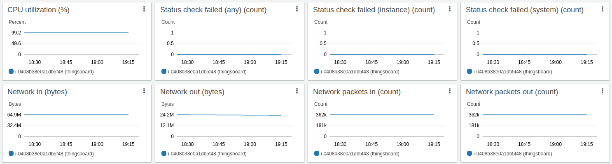

* TOC
{:toc}

How about performance?

Everything perfect when you do the first step, but what happens when you go production? 
How many resources do you need to scale up? Let's discover!

We are going to spin up a few AWS instances with different resources and find out the limits for each one of this.

## Performance test methodology

The technique is quite simple and easy to reproduce. Here the special [performance-test tool](https://github.com/thingsboard/performance-tests/#running). 
It creates entities like devices, dashboards, etc. Then sends telemetry the same way as device do. 
As an output we will analyse the Thingsboard rule engine statistics dashboard and fancy API usage stats feature.
The goal is to compare the performance on each instance and chose between postgres and cassandra telemetry storage.

To run clear test lets spin up two instances for Thingsboard and for performance tool. Assign Elastic IP to get permanent access to the instances.


Setup network Security groups for both instances and open TCP ports 22 (SSH), 8080 (HTTP), 1883 (MQTT), 9999 (JMX) for inbound rules for source IPs (office, home, perf-test).


Optionally, setup SSH private keys to access the instances. It is convenient to set up ~/.ssh/config like:
```bash
Host thingsboard
 Hostname 52.50.5.45
 Port 22
 IdentityFile /home/username/.ssh/aws.pem
 IdentitiesOnly yes
 User ubuntu
Host perf-test
 Hostname 34.242.159.12
 Port 22
 IdentityFile /home/username/.ssh/aws.pem
 IdentitiesOnly yes
 User ubuntu
```
{: .copy-code}

We are going use docker and docker-compose to run performance tests, so let's prepare both instances. Login with ssh and run the commands:

```bash
sudo apt update
sudo apt install -y docker docker-compose
# setup some utilities
sudo apt install -y htop iotop
# manage Docker as a non-root user
sudo groupadd docker
sudo usermod -aG docker $USER
newgrp docker
# test non-root docker run
docker run hello-world
```
{: .copy-code}

Prepare docker-compose file on the Thingsboard instance

```bash
cat > docker-compose.yml
```
Copy the config below:

```bash
version: '3'
services:
  postgres:
    restart: always
    image: "postgres:14"
    network_mode: "host"
    environment:
      POSTGRES_DB: thingsboard
      POSTGRES_PASSWORD: postgres
  tb:
    depends_on:
      - postgres
    restart: "always"
    image: "thingsboard/tb"
    network_mode: "host"
    environment:
      SPRING_JPA_DATABASE_PLATFORM: "org.hibernate.dialect.PostgreSQLDialect"
      SPRING_DRIVER_CLASS_NAME: "org.postgresql.Driver"
      SPRING_DATASOURCE_URL: "jdbc:postgresql://localhost:5432/thingsboard"
      SPRING_DATASOURCE_USERNAME: "postgres"
      SPRING_DATASOURCE_PASSWORD: "postgres"
      TB_SERVICE_ID: "tb-node-0"
      DATABASE_TS_TYPE: "sql"
      TB_QUEUE_TYPE: "in-memory"
      HTTP_BIND_PORT: "8080"
      TB_QUEUE_RE_MAIN_PACK_PROCESSING_TIMEOUT_MS: "10000"
      # Java options for 4G instance and JMX enabled
      JAVA_OPTS: " -Xmx2048M -Xms2048M -Dcom.sun.management.jmxremote -Dcom.sun.management.jmxremote.port=9999 -Dcom.sun.management.jmxremote.rmi.port=9999 -Dcom.sun.management.jmxremote.authenticate=false -Dcom.sun.management.jmxremote.ssl=false -Djava.rmi.server.hostname=127.0.0.1" 
```
{: .copy-code}

Press `Ctrl`+`Shift`+`V` to paste and `Ctrl`+`D` to save the `docker-compose.yml`

Let's add IP address of Thingsboard to the Performance test instance

```bash
ssh perf-test
```
```bash
#replace with your Thingsboard instance ip
echo '52.50.5.45 thingsboard' | sudo tee -a /etc/hosts
```

For the sake of simplicity, we are using a [docker-compose host network mode](https://docs.docker.com/compose/compose-file/compose-file-v3/#network_mode).

## Run the test

### Start the new Thingsboard

```bash
ssh thingsboard
```
```bash
# stop previous instance
docker-compose stop
# remove previous instance (old data will be lost)
docker-compose rm
# run new instance from scratch 
docker-compose up 
```

### Run the Performance test

```bash
ssh perf-test
```
```bash
docker run -it --rm --network host --name tb-perf-test \
  --env REST_URL=http://thingsboard:8080 \
  --env MQTT_HOST=thingsboard \
  --env DEVICE_END_IDX=6000 \
  --env MESSAGES_PER_SECOND=6000 \
  --env ALARMS_PER_SECOND=10 \
  --env DURATION_IN_SECONDS=600 \
  thingsboard/tb-ce-performance-test:latest
```
{: .copy-code}

Open your browser and go http://52.50.5.45:8080/dashboards and login. Use your instance IP address instead.  
Default login for demo instance is `tenant@thingsboard.org`, password is `tenant`.


Choose the "Rule Engine Statistics" dashboard. You can see how the system perform under the load.


Another fancy feature is the API usage page


### Monitor the Thingsboard Java application

To monitor Thingsboard application we will use the [Visual VM](https://visualvm.github.io/)
The JMX have been enabled in `docker-compose.yml` with this line  

```bash
JAVA_OPTS: " -Dcom.sun.management.jmxremote -Dcom.sun.management.jmxremote.port=9999 -Dcom.sun.management.jmxremote.rmi.port=9999 -Dcom.sun.management.jmxremote.authenticate=false -Dcom.sun.management.jmxremote.ssl=false -Djava.rmi.server.hostname=127.0.0.1"
```

Let's forward JMX port from Thingsboard instance to the local machine

```bash
ssh -L 9999:127.0.0.1:9999 thingsboard 
```

Now we can connect with VisualVM to the Thingsboard application and discover the internals


To monitor PostgreSQL database we are going to use the pgadmin. Here is how to [download and install pgadmin](https://www.pgadmin.org/download/).  
Open pgadmin  


Create a new connection like shown below. As example, we are going to connect to the AWS EC2 instance with SSH tunneling feature. The host name is the localhost for that case.


The default PostgreSQL user is thingsboard, default password is postgres. Please, put your credentials here instead of default. 


To use SSH tunneling, put your Thingsboard instance IP and identity file (same as using to connect from terminal) for AWS EC2 instance.   


As result, you can see the dashboard with real time PostgreSQL metrics.


Notice. If you are running the PostgreSQL in container isolated from host network, your connection will come with internal docker IP and you should configure security configuration in the [pg_hba.conf](https://www.postgresql.org/docs/current/auth-pg-hba-conf.html) file.

## Run tests

### m6a.large (2 vCPUs AMD EPYC 3rd, 8 GiB, EBS GP3) 

6000 devices, MQTT, 6000 msg/sec, 18000 telemetry/sec, postgres, in-memory queue

Estimated cost 42$ EC2 + 8$ EBS GP3 100GB = 50$/mo

CPU 98% - *THIS IS NOT A PRODUCTION CASE*!

```bash
docker run -it --rm --network host --name tb-perf-test \
  --env REST_URL=http://thingsboard:8080 \
  --env MQTT_HOST=thingsboard \
  --env DEVICE_END_IDX=6000 \
  --env MESSAGES_PER_SECOND=6000 \
  --env ALARMS_PER_SECOND=10 \
  --env DURATION_IN_SECONDS=600 \
  thingsboard/tb-ce-performance-test:latest
```
{: .copy-code}





  


### t3.medium (2 vCPUs Intel , 4 GiB, EBS GP3)

5000 devices, MQTT, 1000 msg/sec, 3000 telemetry/sec, postgres, in-memory queue

Estimated cost 19$ EC2 + x$ CPU burst + 8$ EBS GP3 100GB = 30$/mo

CPU 27%. This is good setup up to 1000 msg/sec

System can survive and run stable with an up to x3 message rate (3000 msg/sec).  
Cloud provider will charge you against CPU burst, but the production will up and running fine.

Note: t3.medium is a burstable cloud instance with a base level performance 20% of CPU load. When you idle, unused CPU time accumulated.
So please, design your instance to use below 20%

Tip: Enable Unlimited mode in credit specification to get a good performance at first steps 
and survive extra load above the limit (additional charges may apply). 
At the first start you have 0 credits to burst CPU up and the system is throttled down to baseline 20% CPU. 
So the first setup is quite slow without "unlimited mode".
The standard mode will throttle you down in favour to keep you budget, but that is not for a stable production 


Thingsboard docker-compose
```bash
version: '3'
services:
  postgres:
    image: "postgres:14"
    network_mode: "host"
    restart: "always"
    environment:
      POSTGRES_DB: "thingsboard"
      POSTGRES_PASSWORD: "postgres"
  tb:
    depends_on:
      - postgres
    image: "thingsboard/tb"
    network_mode: "host"
    restart: "always"
    environment:
      DATABASE_TS_TYPE: "sql"
      TB_QUEUE_TYPE: "in-memory"
      TB_SERVICE_ID: "tb-node-0"
      HTTP_BIND_PORT: "8080"
      TB_QUEUE_RE_MAIN_PACK_PROCESSING_TIMEOUT_MS: "30000"
      TB_QUEUE_RE_MAIN_CONSUMER_PER_PARTITION: "false"
      # Postgres connection
      SPRING_JPA_DATABASE_PLATFORM: "org.hibernate.dialect.PostgreSQLDialect"
      SPRING_DRIVER_CLASS_NAME: "org.postgresql.Driver"
      SPRING_DATASOURCE_URL: "jdbc:postgresql://localhost:5432/thingsboard"
      SPRING_DATASOURCE_USERNAME: "postgres"
      SPRING_DATASOURCE_PASSWORD: "postgres"
      # Java options for 4G instance and JMX enabled
      JAVA_OPTS: " -Xmx2048M -Xms2048M -Dcom.sun.management.jmxremote -Dcom.sun.management.jmxremote.port=9999 -Dcom.sun.management.jmxremote.rmi.port=9999 -Dcom.sun.management.jmxremote.authenticate=false -Dcom.sun.management.jmxremote.ssl=false -Djava.rmi.server.hostname=127.0.0.1"
```
{: .copy-code}

Performance test docker run
```bash
docker run -it --rm --network host --name tb-perf-test \
  --env REST_URL=http://thingsboard:8080 \
  --env MQTT_HOST=thingsboard \
  --env DEVICE_END_IDX=5000 \
  --env MESSAGES_PER_SECOND=1000 \
  --env ALARMS_PER_SECOND=10 \
  --env DURATION_IN_SECONDS=86400 \
  thingsboard/tb-ce-performance-test:latest
```
{: .copy-code}

Here some charts


#### t3.medium x3 peak survive in-memory

Let's try to handle some messages flood about x3 of regular rate up to 10000 telemetry/sec.

5000 devices, MQTT, 3333 msg/sec, 10000 telemetry/sec, postgres, in-memory queue

Message rate have been increased gradually. Test have been passed successfully 

This is a good trade-off configuration to survive and handle message burst with shared CPU instance type and in-memory queue.

However, the shared CPU instances did not guarantee that additional CPU resources will be available at any moment. 
So you can starve with the base CPU level (20% for t3.medium) at the most important moment.
The best practice approach is to set up a persistent queue service like a Kafka.

Thingsboard docker compose with no change.

Performance test was stopped and run with a greater numbers step by step 

```bash
docker run -it --rm --network host --name tb-perf-test \
  --env REST_URL=http://thingsboard:8080 \
  --env MQTT_HOST=thingsboard \
  --env DEVICE_END_IDX=5000 \
  --env MESSAGES_PER_SECOND=3333 \
  --env ALARMS_PER_SECOND=10 \
  --env DURATION_IN_SECONDS=86400 \
  --env DEVICE_CREATE_ON_START=false \
  thingsboard/tb-ce-performance-test:latest
```
{: .copy-code}

Here some great shots


#### t3.medium x10 peak or how to crash any in-memory queue?

Maybe it is a not good idea to show how to crash the Thingsboard IoT platform with the *in-memory queue*.

But it may be a good experience in system design.

The goal is to help for anyone to avoid a bad design. And save the money, data, customers and reputation.

As you know, the resource is limited. 
CPU is limited in performance. Memory is limited in size and throughput. 
Storage has a limited capacity, operations per second (IOPS), throughput and read/write latency as well.
Network is limited by speed, throughput, latency, packets, etc.

Despite all this boring limitation, all we experience the fast and reliable services all over the internet.

So how is it possible that software goes down in the most important moment?
Is it buggy code? Is it slow? Is it aliens or attackers? 
Should I spend few thousand dollars on the most powerful high-end cloud and keep calm?
Unfortunately, it not works in that way.

Eventually, you can get in-memory messages more than you have memory available.

Typical scenario: processing less than 100% -> messages flood the memory -> out of memory -> messages lost -> service down for 1-2 minutes.

So what if we persist our messages on disk and keep our memory clean? 
Then read messages by small batches and process as fast (or slow) as we can. Memory stay clear. That may help!
Hopefully, we have a service queue and Kafka is a good example.

So let's generate some message rate spike. CPU and disk will not able to process and save all the messages.
Some lag will build up. Let's see what is going on in memory and what the consequences on in-memory queue flood.  

Let's burn this tiny instance with x10 message rate

```bash
docker run -it --rm --network host --name tb-perf-test \
  --env REST_URL=http://thingsboard:8080 \
  --env MQTT_HOST=thingsboard \
  --env DEVICE_END_IDX=5000 \
  --env MESSAGES_PER_SECOND=10000 \
  --env ALARMS_PER_SECOND=10 \
  --env DURATION_IN_SECONDS=86400 \
  --env DEVICE_CREATE_ON_START=false \
  thingsboard/tb-ce-performance-test:latest
```
{: .copy-code}

At the beginning the system looks busy, but responsive.


Then the instance become short on memory and overall performance degrade. 


We see on JMX monitor that used heap memory is growing.


It takes about 10 minutes to flood all the memory and system become unresponsive.


Another 3 minutes to die and a new life begin.


```
tb_1        | java.lang.OutOfMemoryError: Java heap space
tb_1        | Dumping heap to java_pid76.hprof ...
tb_1        | Unable to create java_pid76.hprof: Permission denied
tb_1        | Terminating due to java.lang.OutOfMemoryError: Java heap space
postgres_1  | 2021-12-30 12:07:49.237 UTC [1896] LOG:  incomplete message from client
tb_1        | Starting ThingsBoard ...
```


Conclusion: persisted queue is mandatory for a well loaded production. Kafka is a good one. 

### m6a.large (2 vCPUs AMD EPYC 3rd, 8 GiB, EBS GP3) + Kafka
