* TOC
{:toc}

How about performance?

Everything perfect when you do the first step, but what happens when you go production? 
How many resources do you need to scale up? Let's discover!

We are going to spin up a few AWS instances with different resources and find out the limits for each one of this.

## Performance test methodology

The technique is quite simple and easy to reproduce. Here the special [performance-test tool](https://github.com/thingsboard/performance-tests/#running). 
It creates entities like devices, dashboards, etc. Then sends telemetry the same way as device do. 
As an output we will analyse the Thingsboard rule engine statistics dashboard and fancy API usage stats feature.
The goal is to compare the performance on each instance and chose between postgres and cassandra telemetry storage.

To run clear test lets spin up two instances for Thingsboard and for performance tool. Assign Elastic IP to get permanent access to the instances.


Setup network Security groups for both instances and open TCP ports 22 (SSH), 8080 (HTTP), 1883 (MQTT), 9999 (JMX) for inbound rules for source IPs (office, home, perf-test).


Optionally, setup SSH private keys to access the instances. It is convenient to set up ~/.ssh/config like:
```bash
Host thingsboard
 Hostname 52.50.5.45
 Port 22
 IdentityFile /home/username/.ssh/aws.pem
 IdentitiesOnly yes
 User ubuntu
Host perf-test
 Hostname 34.242.159.12
 Port 22
 IdentityFile /home/username/.ssh/aws.pem
 IdentitiesOnly yes
 User ubuntu
```
{: .copy-code}

We are going use docker and docker-compose to run performance tests, so let's prepare both instances. Login with ssh and run the commands:

```bash
sudo apt update
sudo apt install -y docker docker-compose
# setup some utilities
sudo apt install -y htop iotop
# manage Docker as a non-root user
sudo groupadd docker
sudo usermod -aG docker $USER
newgrp docker
# test non-root docker run
docker run hello-world
```
{: .copy-code}

Prepare docker-compose file on the Thingsboard instance

```bash
cat > docker-compose.yml
```
Copy the config below:

```bash
version: '3'
services:
  postgres:
    image: "postgres:14"
    network_mode: "host"
    restart: "always"
    volumes:
      - postgres:/var/lib/postgresql/data
    environment:
      POSTGRES_DB: thingsboard
      POSTGRES_PASSWORD: postgres
  tb:
    depends_on:
      - postgres
    image: "thingsboard/tb"
    network_mode: "host"
    restart: "always"
    volumes:
      - thingsboard-data:/data
      - thingsboard-logs:/var/log/thingsboard
    environment:
      SPRING_JPA_DATABASE_PLATFORM: "org.hibernate.dialect.PostgreSQLDialect"
      SPRING_DRIVER_CLASS_NAME: "org.postgresql.Driver"
      SPRING_DATASOURCE_URL: "jdbc:postgresql://localhost:5432/thingsboard"
      SPRING_DATASOURCE_USERNAME: "postgres"
      SPRING_DATASOURCE_PASSWORD: "postgres"
      TB_SERVICE_ID: "tb-node-0"
      DATABASE_TS_TYPE: "sql"
      TB_QUEUE_TYPE: "in-memory"
      HTTP_BIND_PORT: "8080"
      TB_QUEUE_RE_MAIN_PACK_PROCESSING_TIMEOUT_MS: "10000"
      # Java options for 4G instance and JMX enabled
      JAVA_OPTS: " -Xmx2048M -Xms2048M -Dcom.sun.management.jmxremote -Dcom.sun.management.jmxremote.port=9999 -Dcom.sun.management.jmxremote.rmi.port=9999 -Dcom.sun.management.jmxremote.authenticate=false -Dcom.sun.management.jmxremote.ssl=false -Djava.rmi.server.hostname=127.0.0.1"
volumes: # to persist data between container restarts or being recreated
  postgres:
  thingsboard-data:
  thingsboard-logs:   
```
{: .copy-code}

Press `Ctrl`+`Shift`+`V` to paste and `Ctrl`+`D` to save the `docker-compose.yml`

Let's add IP address of Thingsboard to the Performance test instance

```bash
ssh perf-test
```
```bash
#replace with your Thingsboard instance ip
echo '52.50.5.45 thingsboard' | sudo tee -a /etc/hosts
```

For the sake of simplicity, we are using a [docker-compose host network mode](https://docs.docker.com/compose/compose-file/compose-file-v3/#network_mode).

## How to run the test

### Start the new Thingsboard

```bash
ssh thingsboard
```
```bash
# stop previous instance
docker-compose stop
# remove previous instance (old data will be lost)
docker-compose rm
# run new instance from scratch 
docker-compose up 
```

### Run the Performance test

```bash
ssh perf-test
```
```bash
docker run -it --rm --network host --name tb-perf-test \
  --env REST_URL=http://thingsboard:8080 \
  --env MQTT_HOST=thingsboard \
  --env DEVICE_END_IDX=6000 \
  --env MESSAGES_PER_SECOND=6000 \
  --env ALARMS_PER_SECOND=10 \
  --env DURATION_IN_SECONDS=600 \
  thingsboard/tb-ce-performance-test:latest
```
{: .copy-code}

Open your browser and go http://52.50.5.45:8080/dashboards and login. Use your instance IP address instead.  
Default login for demo instance is `tenant@thingsboard.org`, password is `tenant`.


Choose the "Rule Engine Statistics" dashboard. You can see how the system perform under the load.


Another fancy feature is the API usage page


### Monitor the Thingsboard Java application

To monitor Thingsboard application we will use the [Visual VM](https://visualvm.github.io/)
The JMX have been enabled in `docker-compose.yml` with this line  

```bash
JAVA_OPTS: " -Dcom.sun.management.jmxremote -Dcom.sun.management.jmxremote.port=9999 -Dcom.sun.management.jmxremote.rmi.port=9999 -Dcom.sun.management.jmxremote.authenticate=false -Dcom.sun.management.jmxremote.ssl=false -Djava.rmi.server.hostname=127.0.0.1"
```

Let's **forward JMX port** from Thingsboard instance to the local machine

```bash
ssh -L 9999:127.0.0.1:9999 thingsboard 
```

Now we can connect with VisualVM to the Thingsboard application and discover the internals


To monitor PostgreSQL database we are going to use the pgadmin. Here is how to [download and install pgadmin](https://www.pgadmin.org/download/).  
Open pgadmin  


Create a new connection like shown below. As example, we are going to connect to the AWS EC2 instance with SSH tunneling feature. The host name is the localhost for that case.

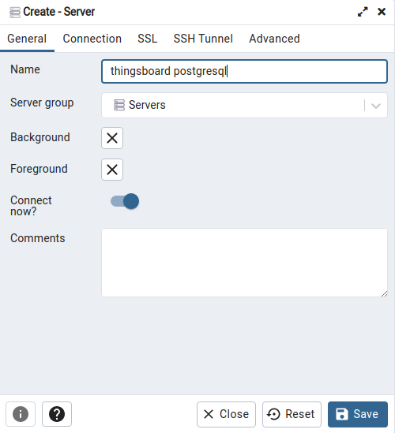

The default PostgreSQL user is thingsboard, default password is postgres. Please, put your credentials here instead of default. 

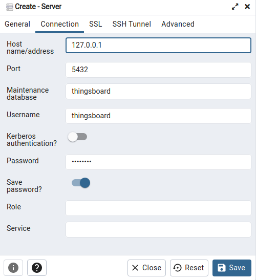

To use SSH tunneling, put your Thingsboard instance IP and identity file (same as using to connect from terminal) for AWS EC2 instance.   

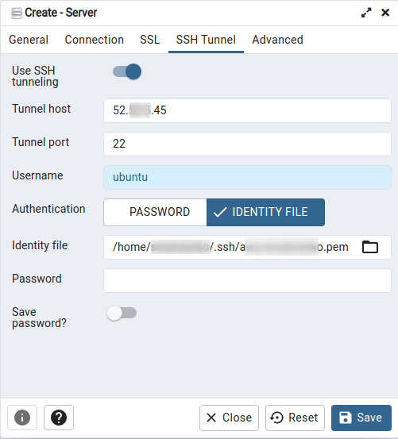

As result, you can see the dashboard with real time PostgreSQL metrics.

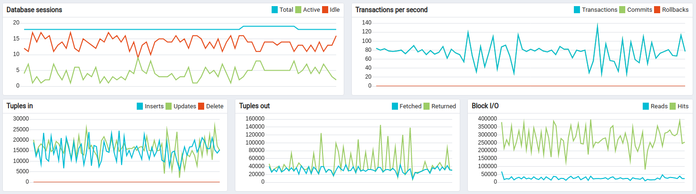

Notice. If you are running the PostgreSQL in container isolated from host network, your connection will come with internal docker IP and you should configure security configuration in the [pg_hba.conf](https://www.postgresql.org/docs/current/auth-pg-hba-conf.html) file.

## Run tests

## Postgres only

### m6a.large (2 vCPUs AMD EPYC 3rd, 8 GiB, EBS GP3) + Postgres - 6k devices, 6k msg/sec, 18k tps

6000 devices, MQTT, 6000 msg/sec, 18000 telemetry/sec, postgres, in-memory queue

Estimated cost 42$ EC2 + 8$ EBS GP3 100GB = 50$/mo

CPU 98% - *THIS IS NOT A PRODUCTION CASE*! 
Check the Thingsboard performance with [Kafka](#m6alarge-2-vcpus-amd-epyc-3rd-8-gib-ebs-gp3--kafka) on the same m6a.large instance. 

```bash
docker run -it --rm --network host --name tb-perf-test \
  --env REST_URL=http://thingsboard:8080 \
  --env MQTT_HOST=thingsboard \
  --env DEVICE_END_IDX=6000 \
  --env MESSAGES_PER_SECOND=6000 \
  --env ALARMS_PER_SECOND=10 \
  --env DURATION_IN_SECONDS=600 \
  thingsboard/tb-ce-performance-test:latest
```
{: .copy-code}

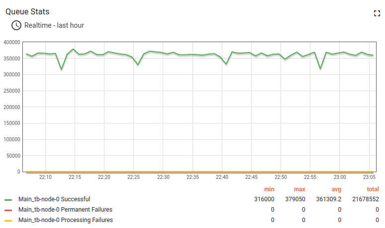


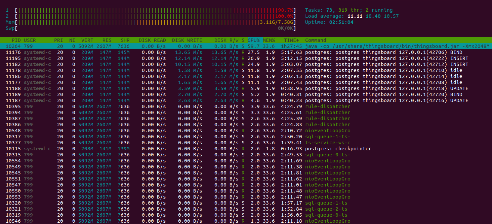

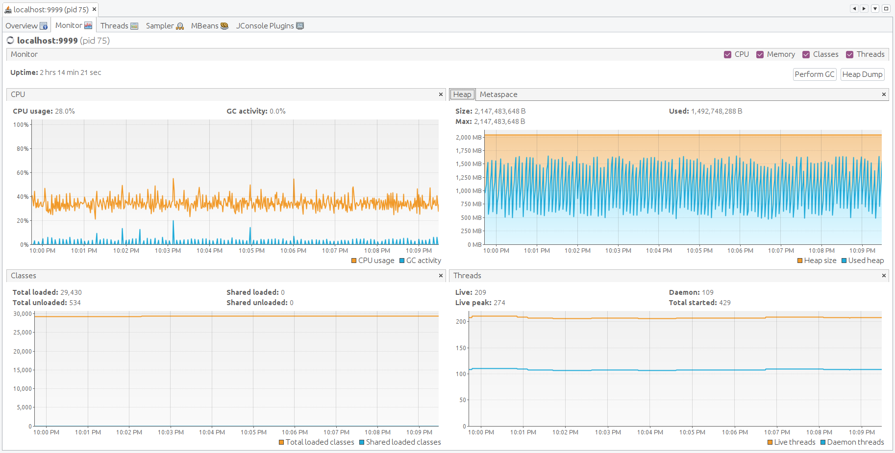

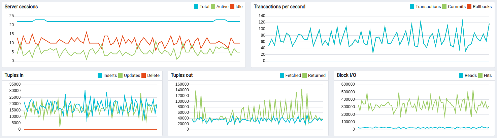


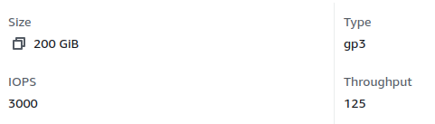
  


### t3.medium (2 vCPUs Intel, 4 GiB, EBS GP3) + Postgres - 5k devices, 1k msg/sec, 3k tps

5000 devices, MQTT, 1000 msg/sec, 3000 telemetry/sec, postgres, in-memory queue

Estimated cost 19$ EC2 + x$ CPU burst + 8$ EBS GP3 100GB = 30$/mo

CPU 27%. This is good setup up to 1000 msg/sec

System can survive and run stable with an up to x3 message rate (3000 msg/sec).  
Cloud provider will charge you against CPU burst, but the production will up and running fine.

Note: t3.medium is a burstable cloud instance with a base level performance 20% of CPU load. When you idle, unused CPU time accumulated.
So please, design your instance to use below 20%

Tip: Enable Unlimited mode in credit specification to get a good performance at first steps 
and survive extra load above the limit (additional charges may apply). 
At the first start you have 0 credits to burst CPU up and the system is throttled down to baseline 20% CPU. 
So the first setup is quite slow without "unlimited mode".
The standard mode will throttle you down in favour to keep you budget, but that is not for a stable production 

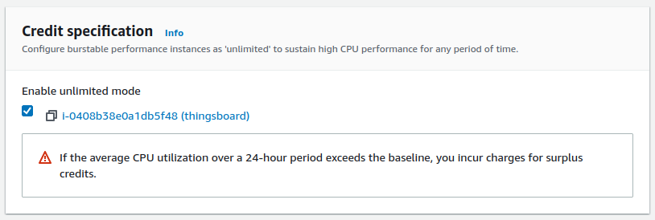

Thingsboard docker-compose
```bash
version: '3'
services:
  postgres:
    image: "postgres:14"
    network_mode: "host"
    restart: "always"
    volumes:
      - postgres:/var/lib/postgresql/data
    environment:
      POSTGRES_DB: "thingsboard"
      POSTGRES_PASSWORD: "postgres"
  tb:
    depends_on:
      - postgres
    image: "thingsboard/tb"
    network_mode: "host"
    restart: "always"
    volumes:
      - thingsboard-data:/data
      - thingsboard-logs:/var/log/thingsboard
    environment:
      DATABASE_TS_TYPE: "sql"
      TB_QUEUE_TYPE: "in-memory"
      TB_SERVICE_ID: "tb-node-0"
      HTTP_BIND_PORT: "8080"
      TB_QUEUE_RE_MAIN_PACK_PROCESSING_TIMEOUT_MS: "30000"
      TB_QUEUE_RE_MAIN_CONSUMER_PER_PARTITION: "false"
      # Postgres connection
      SPRING_JPA_DATABASE_PLATFORM: "org.hibernate.dialect.PostgreSQLDialect"
      SPRING_DRIVER_CLASS_NAME: "org.postgresql.Driver"
      SPRING_DATASOURCE_URL: "jdbc:postgresql://localhost:5432/thingsboard"
      SPRING_DATASOURCE_USERNAME: "postgres"
      SPRING_DATASOURCE_PASSWORD: "postgres"
      # Java options for 4G instance and JMX enabled
      JAVA_OPTS: " -Xmx2048M -Xms2048M -Dcom.sun.management.jmxremote -Dcom.sun.management.jmxremote.port=9999 -Dcom.sun.management.jmxremote.rmi.port=9999 -Dcom.sun.management.jmxremote.authenticate=false -Dcom.sun.management.jmxremote.ssl=false -Djava.rmi.server.hostname=127.0.0.1"
volumes: # to persist data between container restarts or being recreated
  postgres:
  thingsboard-data:
  thingsboard-logs:
```
{: .copy-code}

Performance test docker run
```bash
docker run -it --rm --network host --name tb-perf-test \
  --env REST_URL=http://thingsboard:8080 \
  --env MQTT_HOST=thingsboard \
  --env DEVICE_END_IDX=5000 \
  --env MESSAGES_PER_SECOND=1000 \
  --env ALARMS_PER_SECOND=10 \
  --env DURATION_IN_SECONDS=86400 \
  thingsboard/tb-ce-performance-test:latest
```
{: .copy-code}

Here some charts

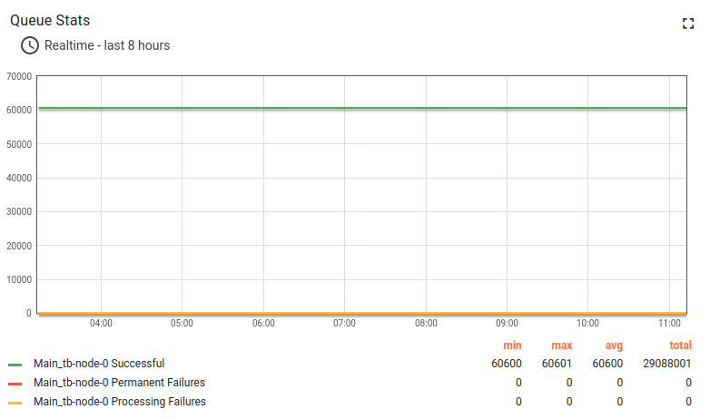

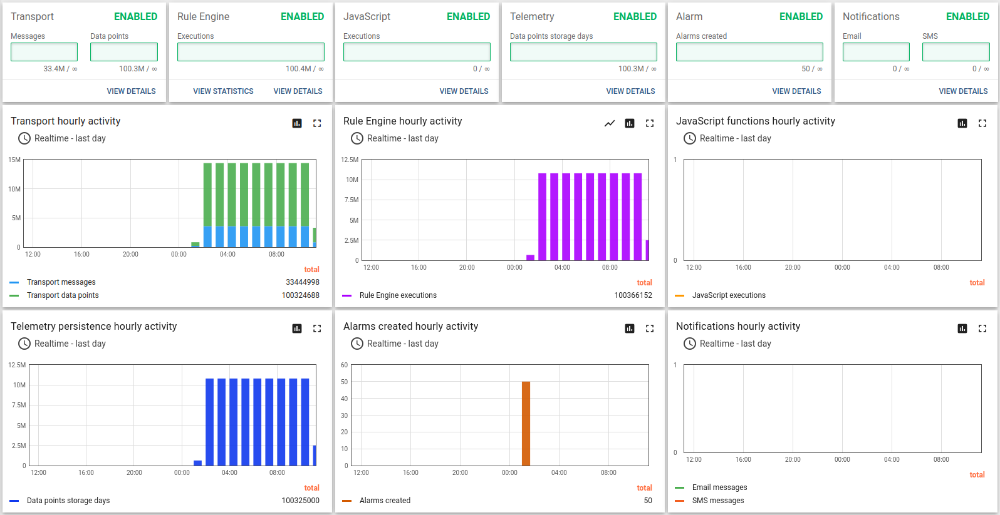

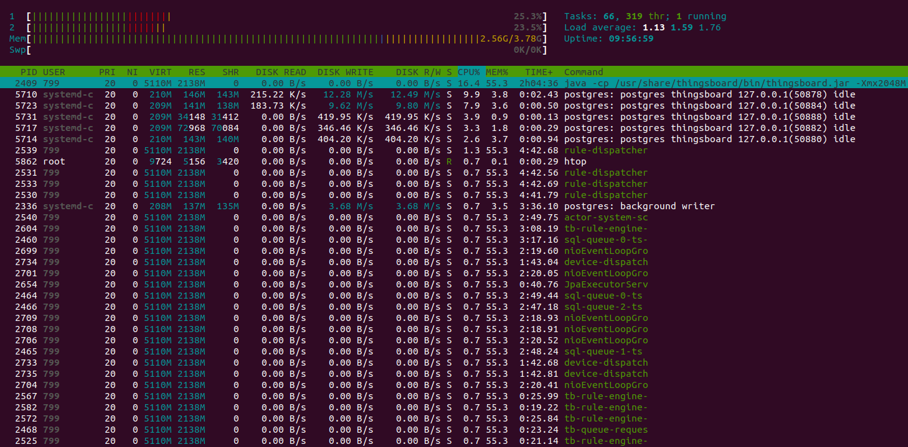


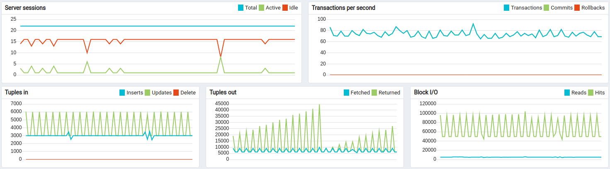

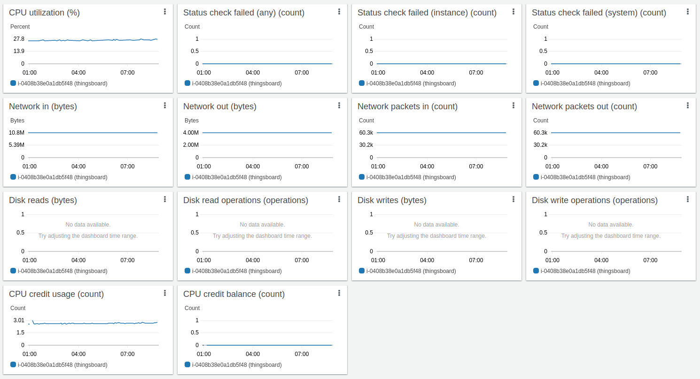

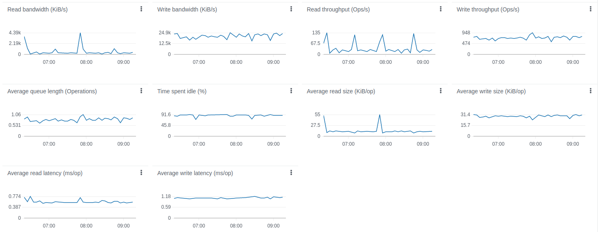

### t3.medium x3 peak survive in-memory + Postgres - 5k devices, 3.3k msg/sec, 10k tps

Let's try to handle some messages flood about x3 of regular rate up to 10000 telemetry/sec.

5000 devices, MQTT, 3333 msg/sec, 10000 telemetry/sec, postgres, in-memory queue

Message rate have been increased gradually. Test have been passed successfully 

This is a good trade-off configuration to survive and handle message burst with shared CPU instance type and in-memory queue.

However, the shared CPU instances did not guarantee that additional CPU resources will be available at any moment. 
So you can starve with the base CPU level (20% for t3.medium) at the most important moment.
The best practice approach is to set up a persistent queue service like a Kafka.

Thingsboard docker compose with no change.

Performance test was stopped and run with a greater numbers step by step 

```bash
docker run -it --rm --network host --name tb-perf-test \
  --env REST_URL=http://thingsboard:8080 \
  --env MQTT_HOST=thingsboard \
  --env DEVICE_END_IDX=5000 \
  --env MESSAGES_PER_SECOND=3333 \
  --env ALARMS_PER_SECOND=10 \
  --env DURATION_IN_SECONDS=86400 \
  --env DEVICE_CREATE_ON_START=false \
  thingsboard/tb-ce-performance-test:latest
```
{: .copy-code}

Here some great shots

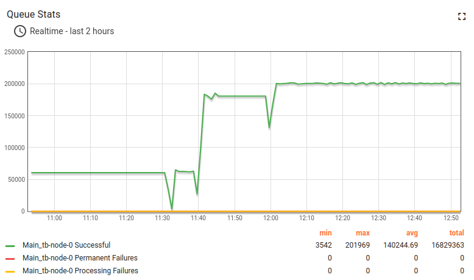

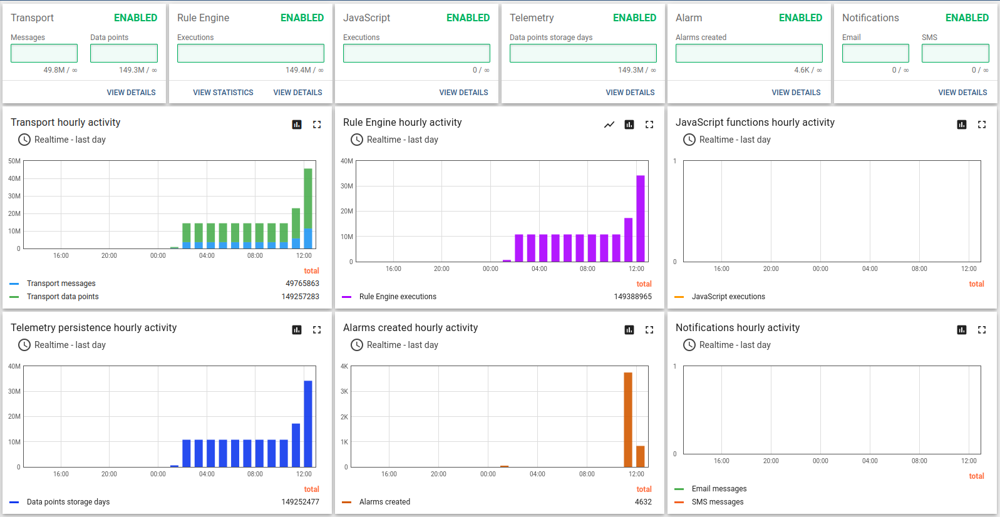

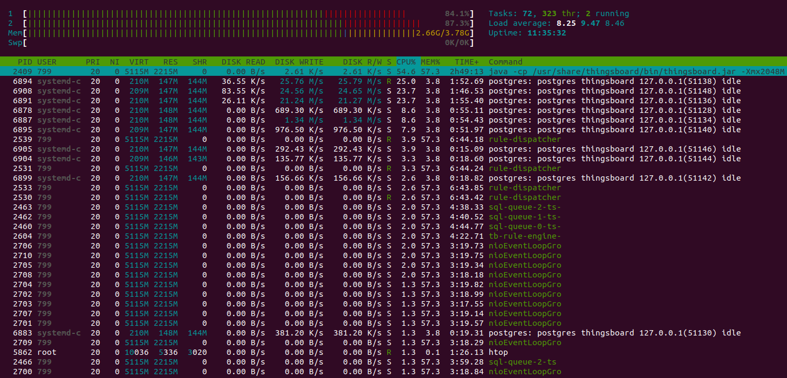

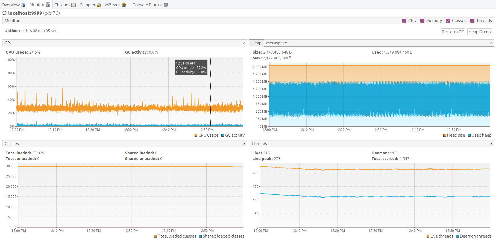

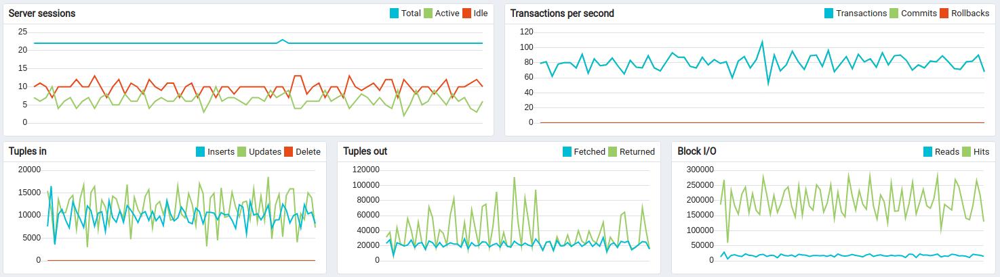

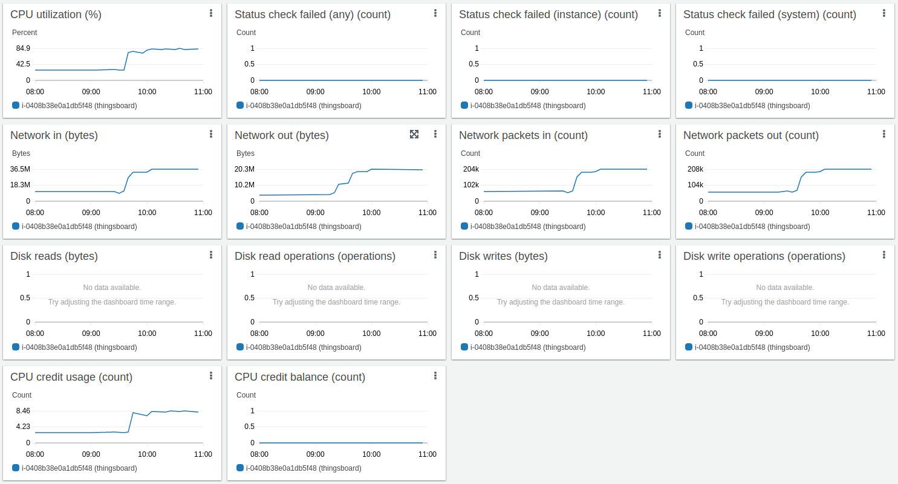

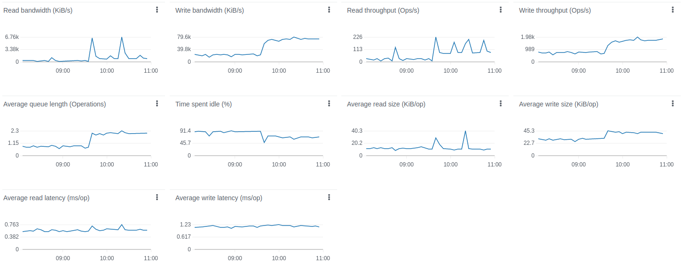

### t3.medium x10 peak or how to crash any in-memory queue + Postgres - 5k devices, 10k msg/sec, 30k tps

Maybe it is a not good idea to show how to crash the Thingsboard IoT platform with the *in-memory queue*.

But it may be a good experience in system design.

The goal is to help for anyone to avoid a bad design. And save the money, data, customers and reputation.

As you know, the resource is limited. 
CPU is limited in performance. Memory is limited in size and throughput. 
Storage has a limited capacity, operations per second (IOPS), throughput and read/write latency as well.
Network is limited by speed, throughput, latency, packets, etc.

Despite all this boring limitation, all we experience the fast and reliable services all over the internet.

So how is it possible that software goes down in the most important moment?
Is it buggy code? Is it slow? Is it aliens or attackers? 
Should I spend few thousand dollars on the most powerful high-end cloud and keep calm?
Unfortunately, it not works in that way.

Eventually, you can get in-memory messages more than you have memory available.

Typical scenario: processing less than 100% -> messages flood the memory -> out of memory -> messages lost -> service down for 1-2 minutes.

So what if we persist our messages on disk and keep our memory clean? 
Then read messages by small batches and process as fast (or slow) as we can. Memory stay clear. That may help!
Hopefully, we have a service queue and Kafka is a good example.

So let's generate some message rate spike. CPU and disk will not able to process and save all the messages.
Some lag will build up. Let's see what is going on in memory and what the consequences on in-memory queue flood.  

Let's burn this tiny instance with x10 message rate

```bash
docker run -it --rm --network host --name tb-perf-test \
  --env REST_URL=http://thingsboard:8080 \
  --env MQTT_HOST=thingsboard \
  --env DEVICE_END_IDX=5000 \
  --env MESSAGES_PER_SECOND=10000 \
  --env ALARMS_PER_SECOND=10 \
  --env DURATION_IN_SECONDS=86400 \
  --env DEVICE_CREATE_ON_START=false \
  thingsboard/tb-ce-performance-test:latest
```
{: .copy-code}

At the beginning the system looks busy, but responsive.

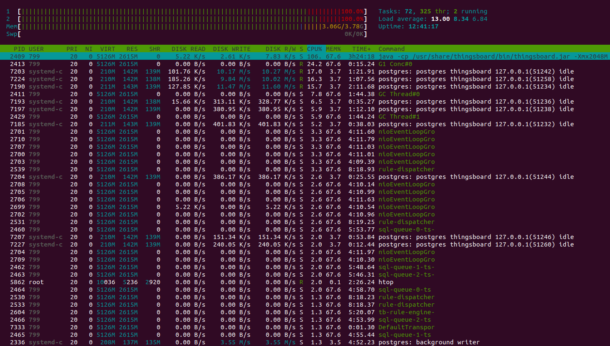

Then the instance become short on memory and overall performance degrade. 

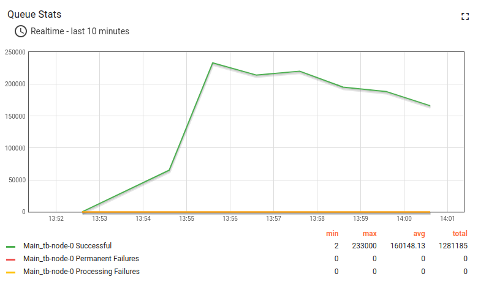

We see on JMX monitor that used heap memory is growing.

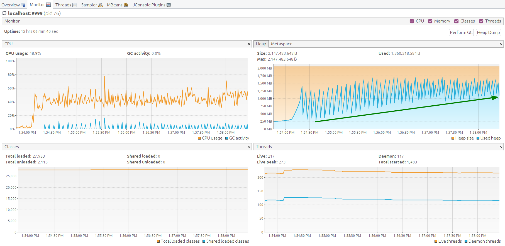

It takes about 10 minutes to flood all the memory and system become unresponsive.

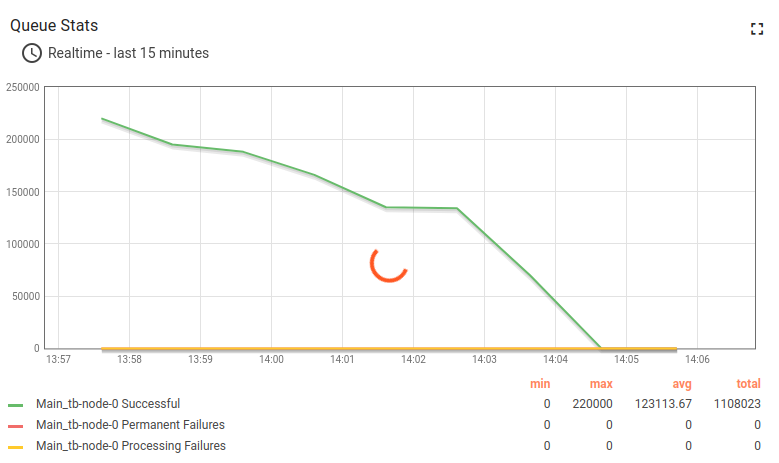

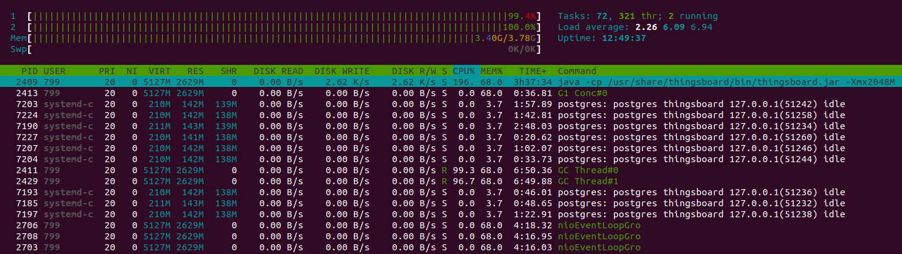

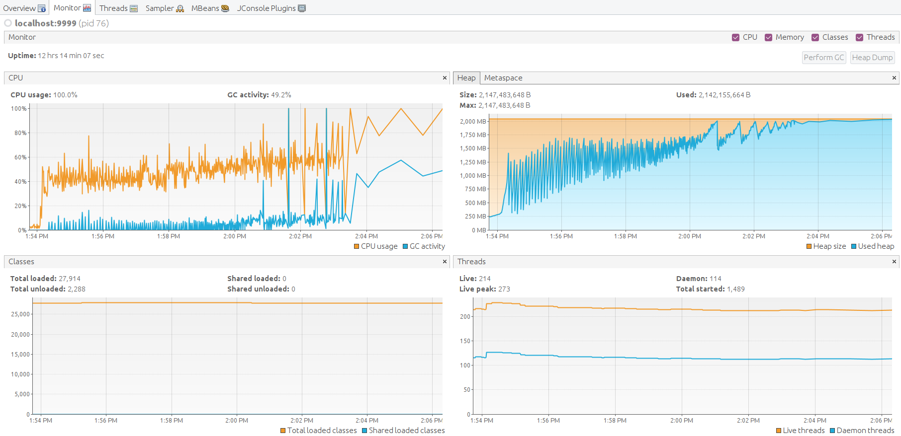

Another 3 minutes to die and a new life begin.

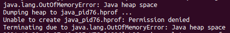

```
tb_1        | java.lang.OutOfMemoryError: Java heap space
tb_1        | Dumping heap to java_pid76.hprof ...
tb_1        | Unable to create java_pid76.hprof: Permission denied
tb_1        | Terminating due to java.lang.OutOfMemoryError: Java heap space
postgres_1  | 2021-12-30 12:07:49.237 UTC [1896] LOG:  incomplete message from client
tb_1        | Starting ThingsBoard ...
```

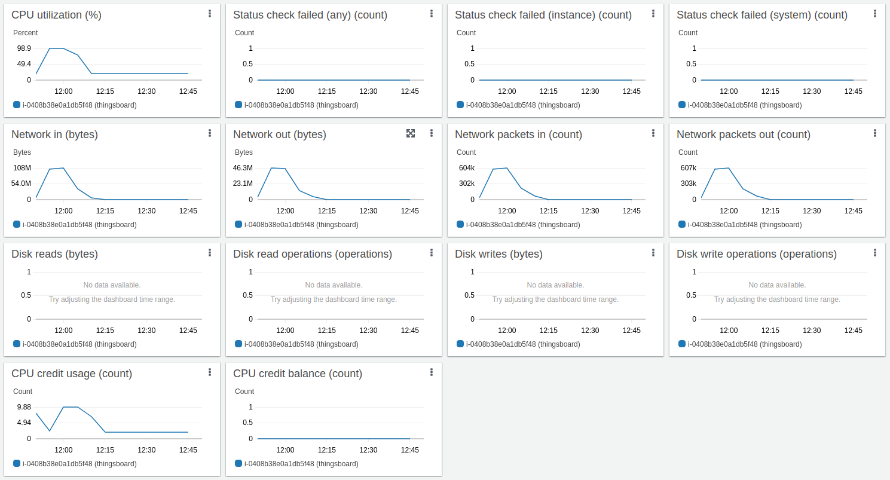

Conclusion: persisted queue is mandatory for a well loaded production. Kafka is a good one. 

## Kafka + Postgres

### m6a.large (2 vCPUs AMD EPYC 3rd, 8 GiB, EBS GP3) + Kafka - 5k devices , 5k msg/sec, 15k tps

5000 devices, MQTT, 5000 msg/sec, 15000 telemetry/sec, postgres, Kafka queue

Estimated cost 19$ EC2 + x$ CPU burst + 8$ EBS GP3 100GB = 30$/mo

CPU 95%. This is good setup up to 5000 msg/sec, with peak performance up to 6000 msg sec

System can survive peak message rate up to message rate 20000 msg/sec (60000 telemetry/sec).

Persistent queue is essential to survive peak loads. Let's setup Kafka queue and run Thingsboard performance test.

Zookeeper is required to run Kafka these days.

Here the docker-compose with Thingsboard + Postgresql + Zookeeper + Kafka 
```bash
version: '3'
services:
  zookeeper:
    image: docker.io/bitnami/zookeeper:3.7
    network_mode: "host"
    restart: "always"
    volumes:
      - zookeeper:/bitnami
    environment:
      ALLOW_ANONYMOUS_LOGIN: "yes"
  kafka:
    image: docker.io/bitnami/kafka:3
    network_mode: "host"
    restart: "always"
    volumes:
      - kafka:/bitnami
    environment:
      - KAFKA_CFG_ZOOKEEPER_CONNECT=localhost:2181
      - ALLOW_PLAINTEXT_LISTENER=yes
    depends_on:
      - zookeeper
  postgres:
    image: "postgres:14"
    network_mode: "host"
    restart: "always"
    volumes:
      - postgres:/var/lib/postgresql/data
    environment:
      POSTGRES_DB: "thingsboard"
      POSTGRES_PASSWORD: "postgres"
  tb:
    depends_on:
      - postgres
      - kafka
    image: "thingsboard/tb"
    network_mode: "host"
    restart: "always"
    volumes:
      - thingsboard-data:/data
      - thingsboard-logs:/var/log/thingsboard
    environment:
      DATABASE_TS_TYPE: "sql"
      TB_QUEUE_TYPE: "kafka"
      TB_KAFKA_BATCH_SIZE: "65536" # default is 16384 - it helps to produce messages much efficiently
      TB_KAFKA_LINGER_MS: "5" # default is 1
      TB_QUEUE_KAFKA_MAX_POLL_RECORDS: "2048" # default is 8192
      TB_SERVICE_ID: "tb-node-0"
      HTTP_BIND_PORT: "8080"
      TB_QUEUE_RE_MAIN_PACK_PROCESSING_TIMEOUT_MS: "30000"
      # Postgres connection
      SPRING_JPA_DATABASE_PLATFORM: "org.hibernate.dialect.PostgreSQLDialect"
      SPRING_DRIVER_CLASS_NAME: "org.postgresql.Driver"
      SPRING_DATASOURCE_URL: "jdbc:postgresql://localhost:5432/thingsboard"
      SPRING_DATASOURCE_USERNAME: "postgres"
      SPRING_DATASOURCE_PASSWORD: "postgres"
      # Java options for 8G instance and JMX enabled
      JAVA_OPTS: " -Xmx3072M -Xms3072M -Dcom.sun.management.jmxremote -Dcom.sun.management.jmxremote.port=9999 -Dcom.sun.management.jmxremote.rmi.port=9999 -Dcom.sun.management.jmxremote.authenticate=false -Dcom.sun.management.jmxremote.ssl=false -Djava.rmi.server.hostname=127.0.0.1"
volumes: # to persist data between container restarts or being recreated
  kafka:
  zookeeper:
  postgres:
  thingsboard-data:
  thingsboard-logs:
```
{: .copy-code}

Performance test docker run
```bash
docker run -it --rm --network host --name tb-perf-test \
  --env REST_URL=http://thingsboard:8080 \
  --env MQTT_HOST=thingsboard \
  --env DEVICE_END_IDX=5000 \
  --env MESSAGES_PER_SECOND=5000 \
  --env ALARMS_PER_SECOND=50 \
  --env DURATION_IN_SECONDS=86400 \
  thingsboard/tb-ce-performance-test:latest
```
{: .copy-code}

Here results:

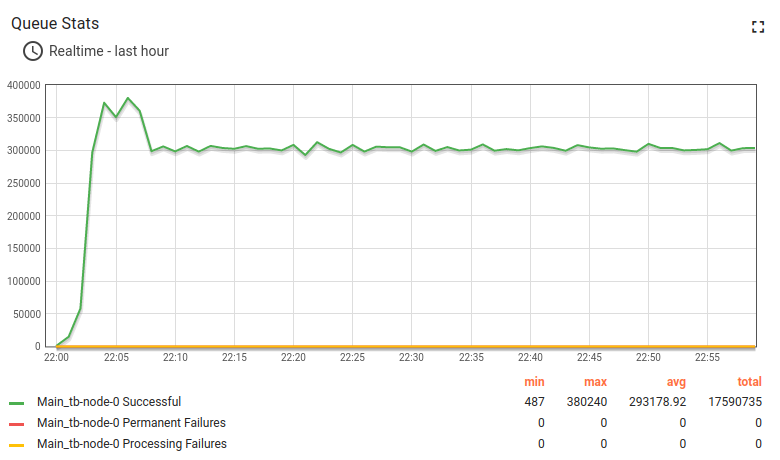


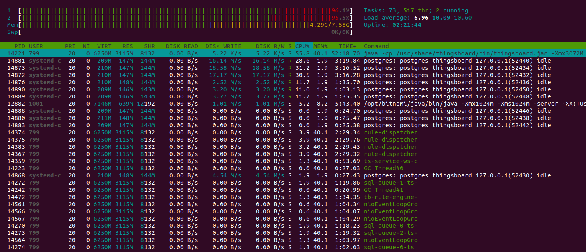

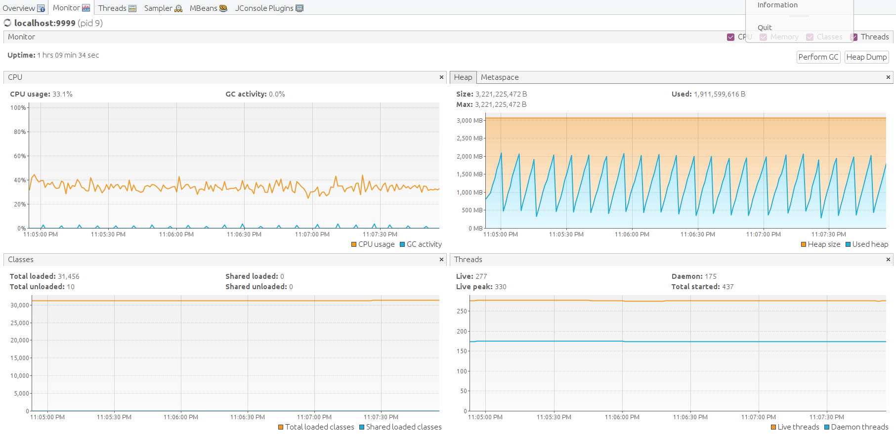


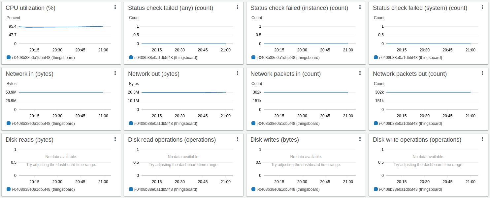

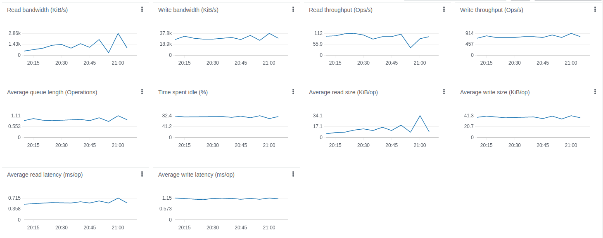

Long-running result about 14 hours:

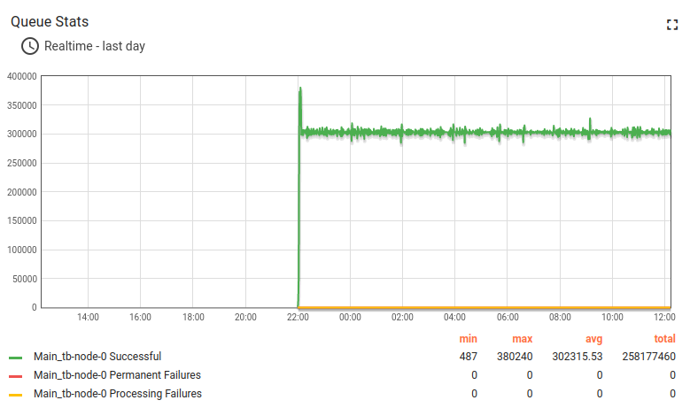

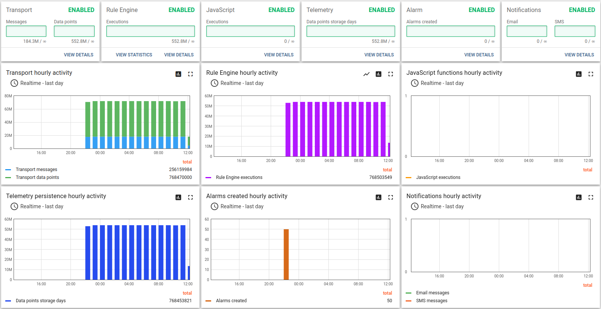

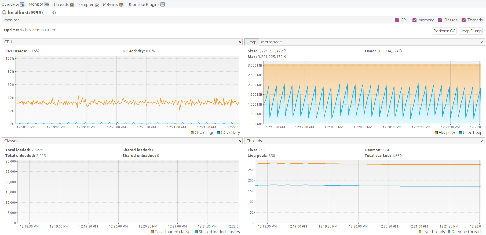

### m6a.large Stress test x3 Thingsbord + Postgresql + Kafka - 5k devices , 15k msg/sec, 45k tps

Stress test for 5k devices, 15k msg/sec, 45k data points/sec

```bash
docker run -it --rm --network host --name tb-perf-test \
  --env REST_URL=http://thingsboard:8080 \
  --env MQTT_HOST=thingsboard \
  --env DEVICE_END_IDX=5000 \
  --env MESSAGES_PER_SECOND=15000 \
  --env ALARMS_PER_SECOND=50 \
  --env DURATION_IN_SECONDS=86400 \
  --env DEVICE_CREATE_ON_START=false \
  thingsboard/tb-ce-performance-test:latest
```
{: .copy-code}

We can see the 100% CPU utilization, system is overloaded. 

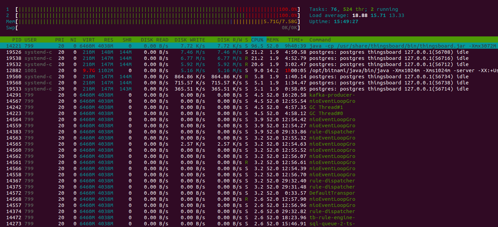

But all non-processed messages goes to the Kafka (will be persisted eventually) and wait until rule engine be able to poll and process it.

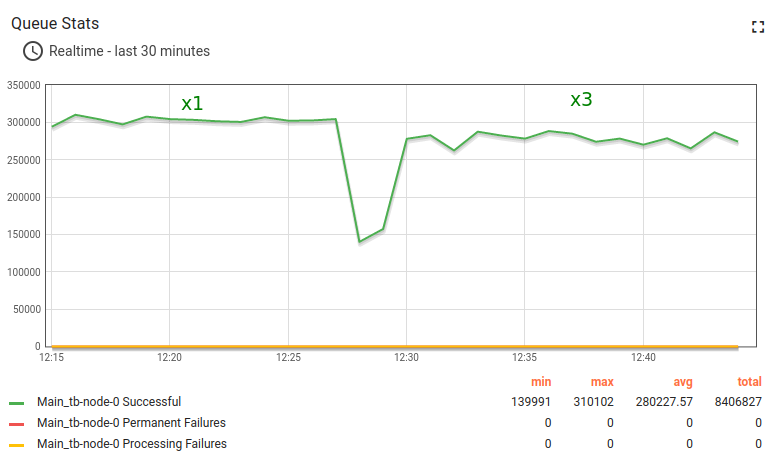

Java machine feels good. heap have enough space to operate. Let's perform garbage collection manually to find the lowest point of the memory consumption. That is a good result.

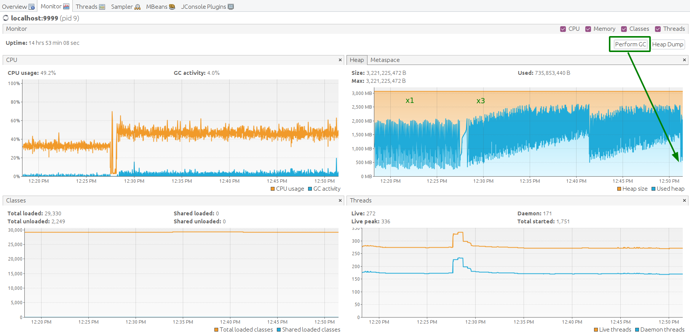

Another way to ensure that we run stable is to check the Kafka producer state with JMX MBean.

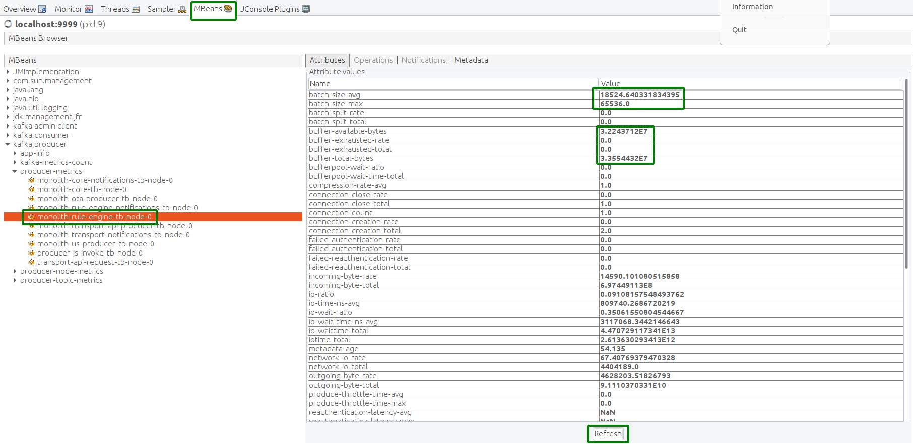

**Kafka Lag** is building up. We can find the log message like that and find out how the rule engine behind the message producer. 
```
tb_1         | 2022-01-01 11:13:09,206 [kafka-consumer-stats-9-thread-1] INFO  o.t.s.q.k.TbKafkaConsumerStatsService - [re-Main-consumer] Topic partitions with lag: [[topic=[tb_rule_engine.main.8], partition=[0], committedOffset=[26696438], endOffset=[29404398], lag=[2707960]], [topic=[tb_rule_engine.main.9], partition=[0], committedOffset=[27799786], endOffset=[30629198], lag=[2829412]], [topic=[tb_rule_engine.main.6], partition=[0], committedOffset=[27283852], endOffset=[30050510], lag=[2766658]], [topic=[tb_rule_engine.main.7], partition=[0], committedOffset=[27793408], endOffset=[30614682], lag=[2821274]], [topic=[tb_rule_engine.main.4], partition=[0], committedOffset=[27997981], endOffset=[30898332], lag=[2900351]], [topic=[tb_rule_engine.main.5], partition=[0], committedOffset=[26800755], endOffset=[29517286], lag=[2716531]], [topic=[tb_rule_engine.main.2], partition=[0], committedOffset=[28252902], endOffset=[31198566], lag=[2945664]], [topic=[tb_rule_engine.main.3], partition=[0], committedOffset=[28051043], endOffset=[30958401], lag=[2907358]], [topic=[tb_rule_engine.main.0], partition=[0], committedOffset=[27216979], endOffset=[29997683], lag=[2780704]], [topic=[tb_rule_engine.main.1], partition=[0], committedOffset=[26904413], endOffset=[29637343], lag=[2732930]]].
```

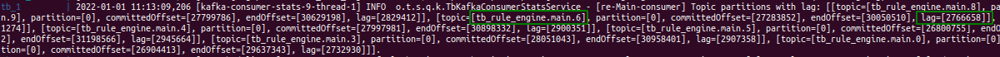

Now let's stop the x3 test and get back to normal message rate (5000 msg/sec) in a minute.

After a while, we may se that the lag is going down from 2.8M to 1.2M
```
tb_1         | 2022-01-01 19:02:10,143 [kafka-consumer-stats-9-thread-1] INFO  o.t.s.q.k.TbKafkaConsumerStatsService - [re-Main-consumer] Topic partitions with lag: [[topic=[tb_rule_engine.main.8], partition=[0], committedOffset=[34495686], endOffset=[35590695], lag=[1095009]], [topic=[tb_rule_engine.main.9], partition=[0], committedOffset=[35596375], endOffset=[37070245], lag=[1473870]], [topic=[tb_rule_engine.main.6], partition=[0], committedOffset=[35066992], endOffset=[36371684], lag=[1304692]], [topic=[tb_rule_engine.main.7], partition=[0], committedOffset=[35600195], endOffset=[37052738], lag=[1452543]], [topic=[tb_rule_engine.main.4], partition=[0], committedOffset=[35816575], endOffset=[37396165], lag=[1579590]], [topic=[tb_rule_engine.main.5], partition=[0], committedOffset=[34554861], endOffset=[35727138], lag=[1172277]], [topic=[tb_rule_engine.main.2], partition=[0], committedOffset=[36037246], endOffset=[37758600], lag=[1721354]], [topic=[tb_rule_engine.main.3], partition=[0], committedOffset=[35825723], endOffset=[37468375], lag=[1642652]], [topic=[tb_rule_engine.main.0], partition=[0], committedOffset=[35020460], endOffset=[36307867], lag=[1287407]], [topic=[tb_rule_engine.main.1], partition=[0], committedOffset=[34693477], endOffset=[35872506], lag=[1179029]]].
```

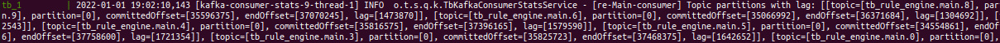

Here the rule engine stats fo x1, x3 amd back to x1 loads.

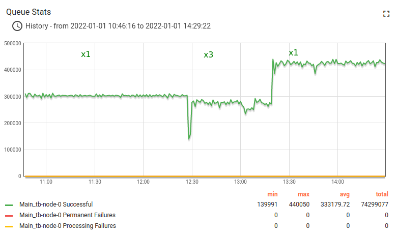

Here is the API usage stats that shows the transport rate (incoming messages and datapoints) and the rule engine performance.

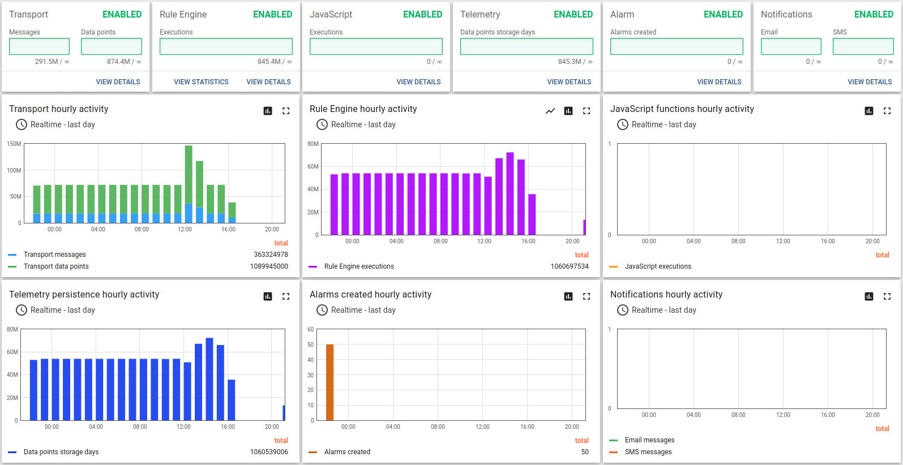

### Disk space usage for Postgres and Kafka

By the end of the day, the system run out of the disk space. 

The 200Gb disk was filled out in about 24 hours with average 5k msg/sec, 15k datapoints/sec; total messages 363M, data points 1.1B.

**Postgres** database size is 160GiB

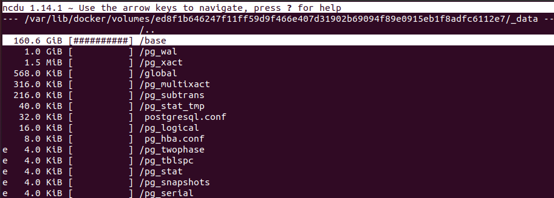

Detailed [PostgreSQL disk usage](https://wiki.postgresql.org/wiki/Disk_Usage) by tables and indexes

```postgresql
SELECT nspname || '.' || relname AS "relation", pg_size_pretty(pg_relation_size(C.oid)) AS "size"
  FROM pg_class C
  LEFT JOIN pg_namespace N ON (N.oid = C.relnamespace)
  WHERE nspname NOT IN ('pg_catalog', 'information_schema')
  ORDER BY pg_relation_size(C.oid) DESC LIMIT 20;
```
You can see the biggest table is timeseries (TS, telemetry) and TS index. All telemetry divided my month to gain a stable performance.  
Test started in December and finished in January. The TS have two tables 2021_12 and 2022_01 for respective months.

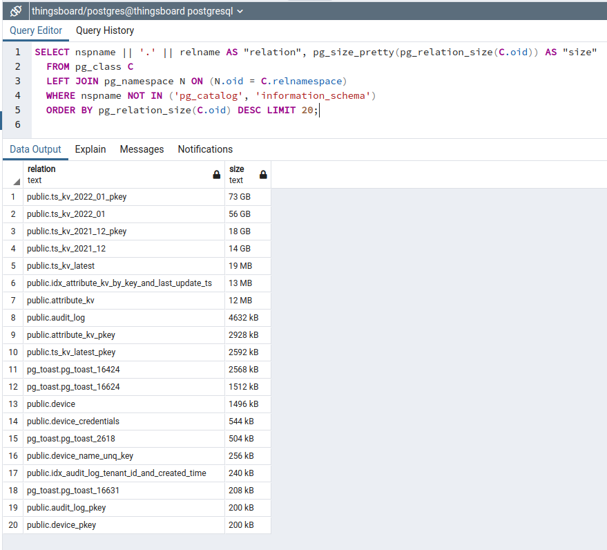

**Kafka** size is 20GiB. 

Tip: to plan and manage the Kafka disk space, please, adjust the [size retention policy](https://kafka.apache.org/documentation/#brokerconfigs_log.retention.bytes) and [period retention policy](https://www.baeldung.com/kafka-message-retention).

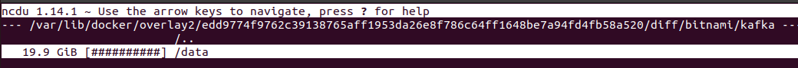

Here the Kafka size by topics.

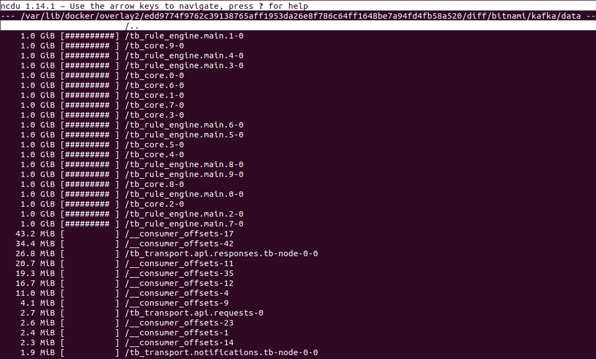

**Conclusion**: Thingsboard + Postgres + **Kafka** - is a reliable solution to survive peak loads.
Despite the maximum performance shown above, we recommend to use m6a.large instance design for up to 3k msg/sec, 10k data points/sec.  
The logic is quite simple: to be able to process x2 message load in case of any peak load.  
In a real production, the Thingboard may serve all kind of user requests, run custom rule chains and supply the web services all fancy dashboards.
When you need more performance, simply upgrade to the next m6a.xlarge or c6i.xlarge instance (restart required).  
Another way to improve is to customize PostgreSQL config to gain much faster read query performance for dashboards, analytics, etc.
For even more performance, please consider the **Cassandra** usage.   

Pros:
 * Reliable solution to survive the peak load
 * Reasonable price for performance and reliability
 * Able to scale (vertically).
 * Short technology stack (Postgres, Kafka)
Cons: 
 * The telemetry storage consumption is quite intensive. It may become expensive if the telemetry time-to-live (TTL) is a years or infinite. 
 * Scale only vertical (faster instance, more storage IOPS) - very limited by hardware available and become expensive.
 * Kafka as a solo instance and messages persists eventually (no fsync called), potential message loss if Kafka crashes.
 * Maintain or fail any of component will lead to downtime for all the system.

## Cassandra + Kafka + Postgres 

### m6a.2xlarge (8 vCPUs AMD EPYC 3rd, 32 GiB, EBS GP3) + Cassandra - 25k devices, 10k msg/sec, 30k tps

**Cassandra** is essential for massive telemetry flow.

25k devices, 10k msg/sec, 30k telemetry/sec, MQTT, Postgres (TS latest), Kafka queue, Cassandra (TS)

Estimated cost 167$ EC2 m6a.2xlarge + 24$ EBS GP3 300GB = 191$/mo

CPU avg 75%. This is good setup with average load 10k msg/sec, 30k data point/sec. 
Peaks will be handled with Kafka queue. It is a **top monolith deployment**. 

Here the docker-compose with Thingsboard + Postgresql + Zookeeper + Kafka + **Cassandra**

```bash
version: '3'
services:
  cassandra:
    image: bitnami/cassandra:4.0
    network_mode: "host"
    restart: "always"
    volumes:
      - cassandra:/bitnami
    environment:
      CASSANDRA_CLUSTER_NAME: "Thingsboard Cluster"
      HEAP_NEWSIZE: "1024M"
      MAX_HEAP_SIZE: "2048M"
      JVM_EXTRA_OPTS: "-Dcom.sun.management.jmxremote -Dcom.sun.management.jmxremote.port=7199 -Dcom.sun.management.jmxremote.rmi.port=7199  -Dcom.sun.management.jmxremote.authenticate=false -Dcom.sun.management.jmxremote.ssl=false -Djava.rmi.server.hostname=127.0.0.1"
  zookeeper:
    image: docker.io/bitnami/zookeeper:3.7
    network_mode: "host"
    restart: "always"
    volumes:
      - zookeeper:/bitnami
    environment:
      ALLOW_ANONYMOUS_LOGIN: "yes"
      ZOO_ENABLE_ADMIN_SERVER: "no"
      JVMFLAGS: "-Xmx128m -Xms128m -Dcom.sun.management.jmxremote -Dcom.sun.management.jmxremote.port=9199 -Dcom.sun.management.jmxremote.rmi.port=9199  -Dcom.sun.management.jmxremote.authenticate=false -Dcom.sun.management.jmxremote.ssl=false -Djava.rmi.server.hostname=127.0.0.1"
  kafka:
    image: docker.io/bitnami/kafka:3
    network_mode: "host"
    restart: "always"
    volumes:
      - kafka:/bitnami
    environment:
      KAFKA_CFG_ZOOKEEPER_CONNECT: "localhost:2181"
      ALLOW_PLAINTEXT_LISTENER: "yes"
      KAFKA_JMX_OPTS: "-Dcom.sun.management.jmxremote -Dcom.sun.management.jmxremote.port=1099 -Dcom.sun.management.jmxremote.rmi.port=1099 -Dcom.sun.management.jmxremote.authenticate=false -Dcom.sun.management.jmxremote.ssl=false -Djava.rmi.server.hostname=127.0.0.1"
      JMX_PORT: "1099"
    depends_on:
      - zookeeper
  postgres:
    image: "postgres:14"
    network_mode: "host"
    restart: "always"
    volumes:
      - postgres:/var/lib/postgresql/data
    environment:
      POSTGRES_DB: "thingsboard"
      POSTGRES_PASSWORD: "postgres"
  tb:
    depends_on:
      - postgres
      - kafka
      - cassandra
    image: "thingsboard/tb"
    network_mode: "host"
    restart: "always"
    volumes:
      - thingsboard-data:/data
      - thingsboard-logs:/var/log/thingsboard
    environment:
      DATABASE_TS_TYPE: "cassandra"
      DATABASE_TS_LATEST_TYPE: "sql"
      #Cassandra
      CASSANDRA_CLUSTER_NAME: "Thingsboard Cluster"
      CASSANDRA_LOCAL_DATACENTER: "datacenter1"
      CASSANDRA_KEYSPACE_NAME: "thingsboard"
      CASSANDRA_URL: "127.0.0.1:9042"
      CASSANDRA_USE_CREDENTIALS: "true"
      CASSANDRA_USERNAME: "cassandra"
      CASSANDRA_PASSWORD: "cassandra"
      CASSANDRA_QUERY_BUFFER_SIZE: "100000"
      CASSANDRA_QUERY_CONCURRENT_LIMIT: "1000"
      CASSANDRA_QUERY_POLL_MS: "10"
      #Kafka
      TB_QUEUE_TYPE: "kafka"
      TB_KAFKA_BATCH_SIZE: "65536" # default is 16384 - it helps to produce messages much efficiently
      TB_KAFKA_LINGER_MS: "5" # default is 1
      TB_QUEUE_KAFKA_MAX_POLL_RECORDS: "2048" # default is 8192
      TB_SERVICE_ID: "tb-node-0"
      HTTP_BIND_PORT: "8080"
      TB_QUEUE_RE_MAIN_PACK_PROCESSING_TIMEOUT_MS: "30000"
      # Postgres connection
      SPRING_JPA_DATABASE_PLATFORM: "org.hibernate.dialect.PostgreSQLDialect"
      SPRING_DRIVER_CLASS_NAME: "org.postgresql.Driver"
      SPRING_DATASOURCE_URL: "jdbc:postgresql://localhost:5432/thingsboard"
      SPRING_DATASOURCE_USERNAME: "postgres"
      SPRING_DATASOURCE_PASSWORD: "postgres"
      # Cache specs
      CACHE_SPECS_DEVICES_MAX_SIZE: "123456" # default is 10000
      CACHE_SPECS_DEVICE_CREDENTIALS_MAX_SIZE: "123456" # default is 10000 
      CACHE_SPECS_SESSIONS_MAX_SIZE: "123456" # default is 10000
      # Java options for 8G instance and JMX enabled
      JAVA_OPTS: " -Xmx3072M -Xms3072M -Dcom.sun.management.jmxremote -Dcom.sun.management.jmxremote.port=9999 -Dcom.sun.management.jmxremote.rmi.port=9999 -Dcom.sun.management.jmxremote.authenticate=false -Dcom.sun.management.jmxremote.ssl=false -Djava.rmi.server.hostname=127.0.0.1"
volumes: # to persist data between container restarts or being recreated
  cassandra:
  kafka:
  zookeeper:
  postgres:
  thingsboard-data:
  thingsboard-logs:
```
{: .copy-code}

```bash
docker run -it --rm --network host --name tb-perf-test \
  --env REST_URL=http://thingsboard:8080 \
  --env MQTT_HOST=thingsboard \
  --env DEVICE_END_IDX=25000 \
  --env MESSAGES_PER_SECOND=10000 \
  --env ALARMS_PER_SECOND=50 \
  --env DURATION_IN_SECONDS=86400 \
  thingsboard/tb-ce-performance-test:latest
```

Here the queue stats. It looks solid. A small fluctuation on the chart is nominal.  
All systems have to run maintenance in background, so it is completely fine to have those chart for Thingsboard monolith deployment.    

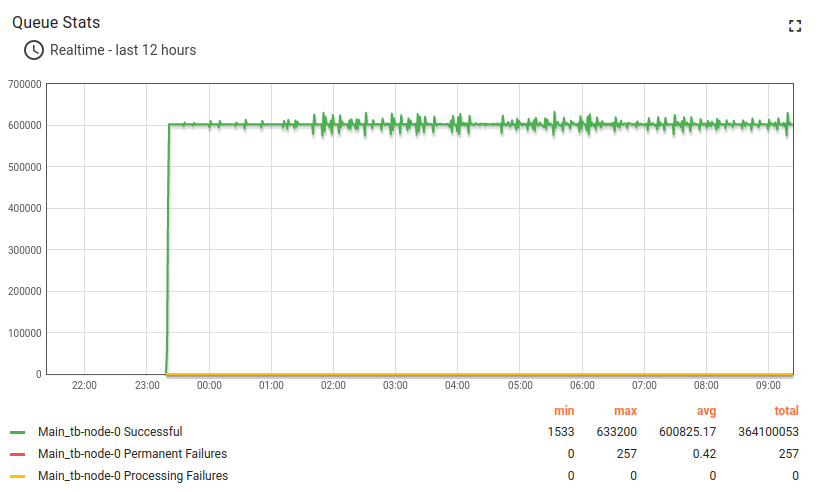

API usage about 10 hours. 1.1B data points


htop shows the system is working normally and have a plenty of resources to handle another jobs.
Memory consumption is about 9GiB, other memory is the system file cache. 
The instance with 16GiB is more that enough to run that load.


Postgres is quite intensive update the TS latest values and reach the peak value about 60k updates/sec.


AWS instance monitoring shows about 75% average CPU load with a peak up to 88%


AWS storage monitoring. The disk load is extremely low compare to the PostgreSQL only deployment


Cassandra's disk size and IOPS usage is quite low (cheaper) compare to PostgreSQL-only deployments.

For 1.15B data points Cassandra uses 33GiB of disk space (29 GiB per 1B data points). 
As reminder, PostgreSQL takes about 161 GiB to persist 1.06B data points (152 GiB per 1B data points). 
It is more than x5 times (152 / 29) cheaper than PostgreSQL disk consumption!


Finally, let's check the JVM state on each Thingboard, Zookeeper, Kafka and Cassandra
Let's forward JMX port with SSH to connect and monitor all Java applications presented.

```bash
ssh -L 9999:127.0.0.1:9999 -L 1099:127.0.0.1:1099 -L 9199:127.0.0.1:9199 -L 7199:127.0.0.1:7199 thingsboard 
```

Open VisualVM, add the local applications, open it and let the data being gathered for a few minutes. 


Here the JMX monitoring for Thingsboard. The system is stable.


Here the JMX monitoring for Kafka. The system is stable.


Here the JMX monitoring for Zookeeper. The system is stable.


Here the JMX monitoring for Cassandra.  The system is stable.

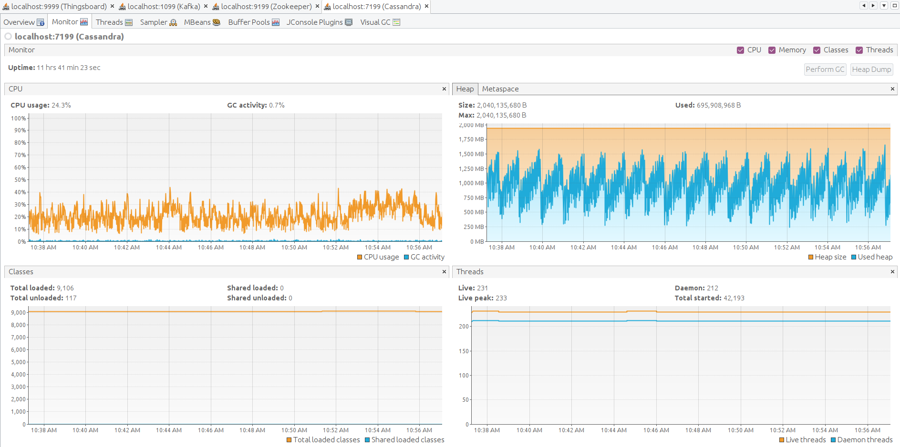

Conclusion: Cassandra requires more CPU resources, but it save x5 disk space, lower IOPS load.
Cassandra can handle x2-x3 more load (compare to PostgreSQL only) with a single instance deployment and able to scale up horizontally by adding a new nodes to the Cassandra cluster.    
It is a good idea to start with Cassandra from the very beginning of your Thingsboard instance and maintain the same stack for the entire project lifetime.
For the lower message rate, you can fit the Cassandra deployment to a much smaller instance adjusting the heap size limits.
System can be scaled up vertically up to 50-100%. For significant horizontal scaling, please, consider to set up a Thingsboard cluster.

### m6a.2xlarge (8 vCPUs AMD EPYC 3rd, 32 GiB, EBS GP3) + Cassandra - 100k devices, 5k msg/sec, 15k tps

To produce 100k connection we need at least 2 performance-test instances. Regarding the maximum port count 65535 on a single server.

First, we need to increase ip local port range on performance test instance that setup many outgoing connections. Now we can open up to 64511 IP ports.  

```bash
ssh pt
cat /proc/sys/net/ipv4/ip_local_port_range
#32768	60999
sudo -s echo "net.ipv4.ip_local_port_range= 1024 65535">> /etc/sysctl.conf
sudo -s sysctl -p
cat /proc/sys/net/ipv4/ip_local_port_range
#1024	65535
ulimit -n 1048576
```

Let's prepare the Thingsboard 

Here the docker-compose with Thingsboard + Postgresql + Zookeeper + Kafka + **Cassandra**

```bash
version: '3'
services:
  cassandra:
    image: bitnami/cassandra:4.0
    network_mode: "host"
    restart: "always"
    volumes:
      - cassandra:/bitnami
    environment:
      CASSANDRA_CLUSTER_NAME: "Thingsboard Cluster"
      HEAP_NEWSIZE: "4096M"
      MAX_HEAP_SIZE: "8192M"
      JVM_EXTRA_OPTS: "-Dcom.sun.management.jmxremote -Dcom.sun.management.jmxremote.port=7199 -Dcom.sun.management.jmxremote.rmi.port=7199  -Dcom.sun.management.jmxremote.authenticate=false -Dcom.sun.management.jmxremote.ssl=false -Djava.rmi.server.hostname=127.0.0.1"
  zookeeper:
    image: docker.io/bitnami/zookeeper:3.7
    network_mode: "host"
    restart: "always"
    volumes:
      - zookeeper:/bitnami
    environment:
      ALLOW_ANONYMOUS_LOGIN: "yes"
      ZOO_ENABLE_ADMIN_SERVER: "no"
      JVMFLAGS: "-Xmx128m -Xms128m -Dcom.sun.management.jmxremote -Dcom.sun.management.jmxremote.port=9199 -Dcom.sun.management.jmxremote.rmi.port=9199  -Dcom.sun.management.jmxremote.authenticate=false -Dcom.sun.management.jmxremote.ssl=false -Djava.rmi.server.hostname=127.0.0.1"
  kafka:
    image: docker.io/bitnami/kafka:3
    network_mode: "host"
    restart: "always"
    volumes:
      - kafka:/bitnami
    environment:
      KAFKA_CFG_ZOOKEEPER_CONNECT: "localhost:2181"
      ALLOW_PLAINTEXT_LISTENER: "yes"
      KAFKA_JMX_OPTS: "-Dcom.sun.management.jmxremote -Dcom.sun.management.jmxremote.port=1099 -Dcom.sun.management.jmxremote.rmi.port=1099 -Dcom.sun.management.jmxremote.authenticate=false -Dcom.sun.management.jmxremote.ssl=false -Djava.rmi.server.hostname=127.0.0.1"
      JMX_PORT: "1099"
    depends_on:
      - zookeeper
  postgres:
    image: "postgres:14"
    network_mode: "host"
    restart: "always"
    volumes:
      - postgres:/var/lib/postgresql/data
    environment:
      POSTGRES_DB: "thingsboard"
      POSTGRES_PASSWORD: "postgres"
  tb:
    depends_on:
      - postgres
      - kafka
      - cassandra
    image: "thingsboard/tb"
    network_mode: "host"
    restart: "always"
    volumes:
      - thingsboard-data:/data
      - thingsboard-logs:/var/log/thingsboard
    environment:
      DATABASE_TS_TYPE: "cassandra"
      DATABASE_TS_LATEST_TYPE: "sql"
      #Cassandra
      CASSANDRA_CLUSTER_NAME: "Thingsboard Cluster"
      CASSANDRA_LOCAL_DATACENTER: "datacenter1"
      CASSANDRA_KEYSPACE_NAME: "thingsboard"
      CASSANDRA_URL: "127.0.0.1:9042"
      CASSANDRA_USE_CREDENTIALS: "true"
      CASSANDRA_USERNAME: "cassandra"
      CASSANDRA_PASSWORD: "cassandra"
      CASSANDRA_QUERY_BUFFER_SIZE: "200000"
      CASSANDRA_QUERY_CONCURRENT_LIMIT: "1000"
      CASSANDRA_QUERY_POLL_MS: "5"
      #Kafka
      TB_QUEUE_TYPE: "kafka"
      TB_KAFKA_BATCH_SIZE: "65536" # default is 16384 - it helps to produce messages much efficiently
      TB_KAFKA_LINGER_MS: "5" # default is 1
      TB_QUEUE_KAFKA_MAX_POLL_RECORDS: "2048" # default is 8192
      TB_SERVICE_ID: "tb-node-0"
      HTTP_BIND_PORT: "8080"
      TB_QUEUE_RE_MAIN_PACK_PROCESSING_TIMEOUT_MS: "30000"
      # Postgres connection
      SPRING_JPA_DATABASE_PLATFORM: "org.hibernate.dialect.PostgreSQLDialect"
      SPRING_DRIVER_CLASS_NAME: "org.postgresql.Driver"
      SPRING_DATASOURCE_URL: "jdbc:postgresql://localhost:5432/thingsboard"
      SPRING_DATASOURCE_USERNAME: "postgres"
      SPRING_DATASOURCE_PASSWORD: "postgres"
      # Cache specs
      CACHE_SPECS_DEVICES_MAX_SIZE: "512000" # default is 10000
      CACHE_SPECS_DEVICE_CREDENTIALS_MAX_SIZE: "512000" # default is 10000 
      CACHE_SPECS_SESSIONS_MAX_SIZE: "512000" # default is 10000
      TS_KV_PARTITIONS_MAX_CACHE_SIZE: "3000000" # default is 100000
      # Device state service
      DEFAULT_INACTIVITY_TIMEOUT: "1800" # defailt is 600 (10min)
      DEFAULT_STATE_CHECK_INTERVAL: "600" # default is 60 (1min)
      PERSIST_STATE_TO_TELEMETRY: "true" # Persist device state to the Cassandra. Default is false (Postgres, as device server_scope attributes)
      # Java options for 16G instance and JMX enabled
      JAVA_OPTS: " -Xmx8192M -Xms8192M -Dcom.sun.management.jmxremote -Dcom.sun.management.jmxremote.port=9999 -Dcom.sun.management.jmxremote.rmi.port=9999 -Dcom.sun.management.jmxremote.authenticate=false -Dcom.sun.management.jmxremote.ssl=false -Djava.rmi.server.hostname=127.0.0.1"
    ulimits:
      nofile:
        soft: 1048576
        hard: 1048576
volumes: # to persist data between container restarts or being recreated
  cassandra:
  kafka:
  zookeeper:
  postgres:
  thingsboard-data:
  thingsboard-logs:
```
{: .copy-code}

Performance tests will be started as an application to reduce complexity using the container
Before you started, clone and build once the performance test:
```bash
cd ~
git clone https://github.com/thingsboard/performance-tests.git
# git pull
cd performance-tests
./build.sh
```

Performance test node1
```bash
cd ~/performance-tests
export REST_URL=http://52.50.5.45:8080 # put Thingsboard API here
export MQTT_HOST=52.50.5.45 # put Thingsboard API here
export DEVICE_START_IDX=0
export DEVICE_END_IDX=50000
export MESSAGES_PER_SECOND=2500
export ALARMS_PER_SECOND=10
export DURATION_IN_SECONDS=86400
export DEVICE_CREATE_ON_START=true # set true once
nohup mvn spring-boot:run &
```

Performance test node2
```bash
cd ~/performance-tests
export REST_URL=http://52.50.5.45:8080 # put Thingsboard API here
export MQTT_HOST=52.50.5.45 # put Thingsboard API here
export DEVICE_START_IDX=50000
export DEVICE_END_IDX=100000
export MESSAGES_PER_SECOND=2500
export ALARMS_PER_SECOND=10
export DURATION_IN_SECONDS=86400
export DEVICE_CREATE_ON_START=true # set true once
nohup mvn spring-boot:run &
```

Test runs 24 hour and here the results:

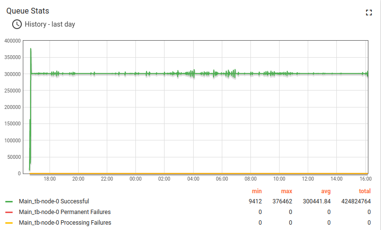

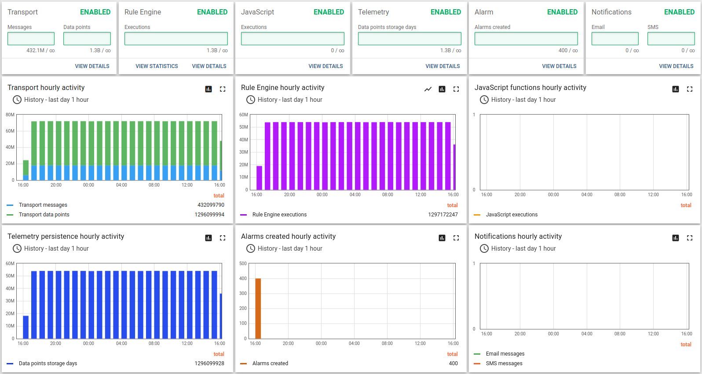

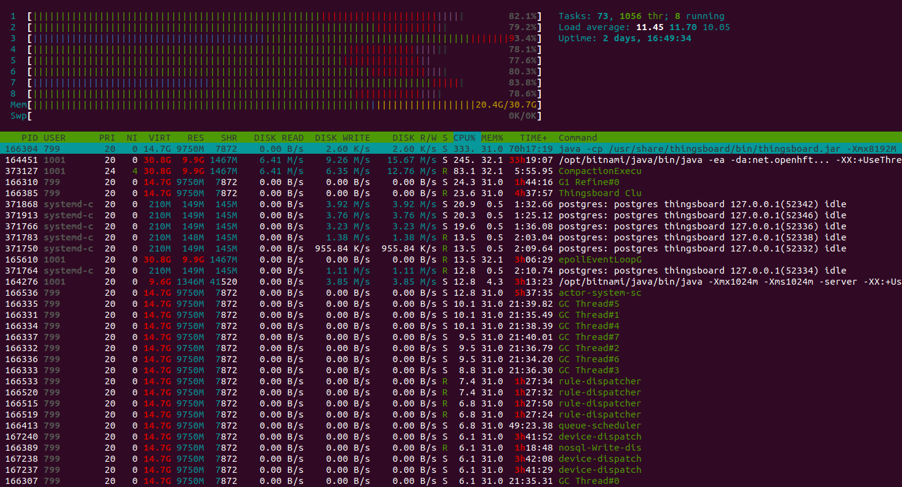

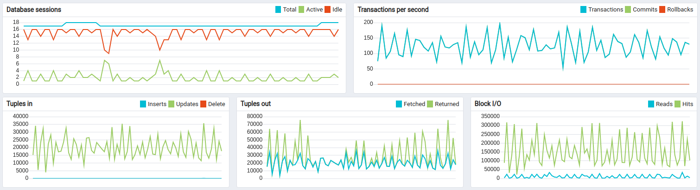

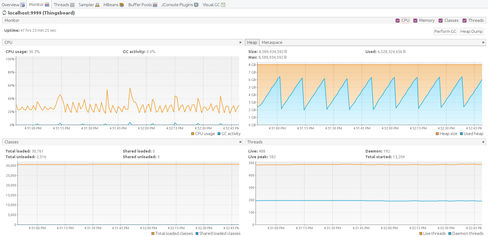

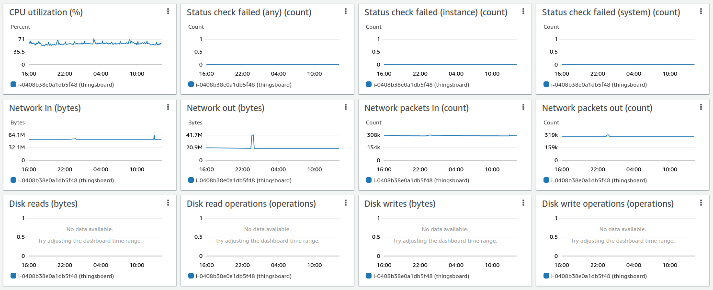

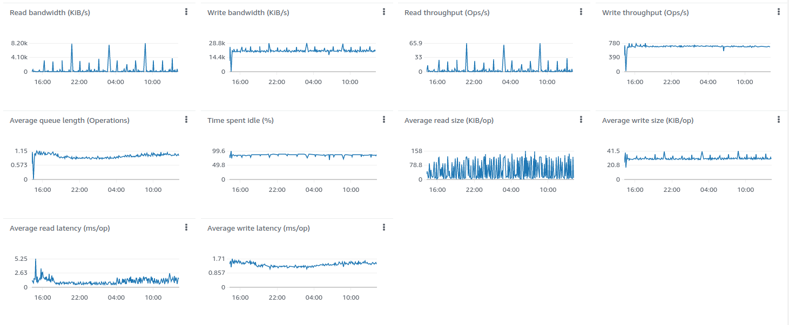

#### Cassandra disk usage

For the last 24 hours (100k devices, 432M msg) total datapoint stored is 1.3B

Cassandra's disk usage is about 20 GiB per 1.3B data points. It is about 65M data points per 1 GiB disk space.

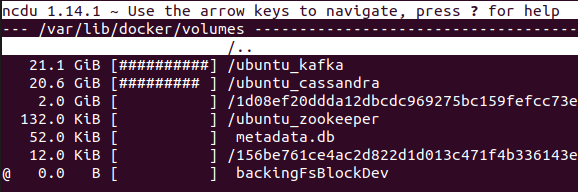

Note: data size on disk may vary depends on the content.

### m6a.2xlarge (8 vCPUs AMD EPYC 3rd, 32 GiB, EBS GP3) + Cassandra - 100k devices, 10k msg/sec, 30k tps

#### Persist device state to attributes (PostgreSQL)

With the msg rate is 10k/sec for 100k devices system can handle about 9k/sec in average.
The CPU load is 90%, so we face the PostgreSQL performance bottleneck. 
It is too many attribute updates with different keys.
The attribute 'lastActivityTime' in trying to update on each message received from device. 
With 5k devices it is no problem, but with 100k devices transaction became much slower.
As the next step we are going to write device state to the Cassandra.

#### Persist device state to telemetry (Cassandra)

Great improvement for performance is to persist device state to Cassandra telemetry.

```yaml
      PERSIST_STATE_TO_TELEMETRY: "true" # Persist device state to the Cassandra. Default is false (Postgres, as device server_scope attributes)
```

Here the docker-compose with Thingsboard + Postgresql + Zookeeper + Kafka + **Cassandra**

```yaml
version: '3'
services:
  cassandra:
    image: bitnami/cassandra:4.0
    network_mode: "host"
    restart: "always"
    volumes:
      - cassandra:/bitnami
    environment:
      CASSANDRA_CLUSTER_NAME: "Thingsboard Cluster"
      HEAP_NEWSIZE: "4096M"
      MAX_HEAP_SIZE: "8192M"
      JVM_EXTRA_OPTS: "-Dcom.sun.management.jmxremote -Dcom.sun.management.jmxremote.port=7199 -Dcom.sun.management.jmxremote.rmi.port=7199  -Dcom.sun.management.jmxremote.authenticate=false -Dcom.sun.management.jmxremote.ssl=false -Djava.rmi.server.hostname=127.0.0.1"
  zookeeper:
    image: docker.io/bitnami/zookeeper:3.7
    network_mode: "host"
    restart: "always"
    volumes:
      - zookeeper:/bitnami
    environment:
      ALLOW_ANONYMOUS_LOGIN: "yes"
      ZOO_ENABLE_ADMIN_SERVER: "no"
      JVMFLAGS: "-Xmx128m -Xms128m -Dcom.sun.management.jmxremote -Dcom.sun.management.jmxremote.port=9199 -Dcom.sun.management.jmxremote.rmi.port=9199  -Dcom.sun.management.jmxremote.authenticate=false -Dcom.sun.management.jmxremote.ssl=false -Djava.rmi.server.hostname=127.0.0.1"
  kafka:
    image: docker.io/bitnami/kafka:3
    network_mode: "host"
    restart: "always"
    volumes:
      - kafka:/bitnami
    environment:
      KAFKA_CFG_ZOOKEEPER_CONNECT: "localhost:2181"
      ALLOW_PLAINTEXT_LISTENER: "yes"
      KAFKA_JMX_OPTS: "-Dcom.sun.management.jmxremote -Dcom.sun.management.jmxremote.port=1099 -Dcom.sun.management.jmxremote.rmi.port=1099 -Dcom.sun.management.jmxremote.authenticate=false -Dcom.sun.management.jmxremote.ssl=false -Djava.rmi.server.hostname=127.0.0.1"
      JMX_PORT: "1099"
    depends_on:
      - zookeeper
  postgres:
    image: "postgres:14"
    network_mode: "host"
    restart: "always"
    volumes:
      - postgres:/var/lib/postgresql/data
    environment:
      POSTGRES_DB: "thingsboard"
      POSTGRES_PASSWORD: "postgres"
  tb:
    depends_on:
      - postgres
      - kafka
      - cassandra
    image: "thingsboard/tb"
    network_mode: "host"
    restart: "always"
    volumes:
      - thingsboard-data:/data
      - thingsboard-logs:/var/log/thingsboard
    environment:
      DATABASE_TS_TYPE: "cassandra"
      DATABASE_TS_LATEST_TYPE: "sql"
      #Cassandra
      CASSANDRA_CLUSTER_NAME: "Thingsboard Cluster"
      CASSANDRA_LOCAL_DATACENTER: "datacenter1"
      CASSANDRA_KEYSPACE_NAME: "thingsboard"
      CASSANDRA_URL: "127.0.0.1:9042"
      CASSANDRA_USE_CREDENTIALS: "true"
      CASSANDRA_USERNAME: "cassandra"
      CASSANDRA_PASSWORD: "cassandra"
      CASSANDRA_QUERY_BUFFER_SIZE: "200000"
      CASSANDRA_QUERY_CONCURRENT_LIMIT: "1000"
      CASSANDRA_QUERY_POLL_MS: "5"
      #Kafka
      TB_QUEUE_TYPE: "kafka"
      TB_KAFKA_BATCH_SIZE: "65536" # default is 16384 - it helps to produce messages much efficiently
      TB_KAFKA_LINGER_MS: "5" # default is 1
      TB_QUEUE_KAFKA_MAX_POLL_RECORDS: "2048" # default is 8192
      TB_SERVICE_ID: "tb-node-0"
      HTTP_BIND_PORT: "8080"
      TB_QUEUE_RE_MAIN_PACK_PROCESSING_TIMEOUT_MS: "30000"
      # Postgres connection
      SPRING_JPA_DATABASE_PLATFORM: "org.hibernate.dialect.PostgreSQLDialect"
      SPRING_DRIVER_CLASS_NAME: "org.postgresql.Driver"
      SPRING_DATASOURCE_URL: "jdbc:postgresql://localhost:5432/thingsboard"
      SPRING_DATASOURCE_USERNAME: "postgres"
      SPRING_DATASOURCE_PASSWORD: "postgres"
      # Cache specs
      CACHE_SPECS_DEVICES_MAX_SIZE: "512000" # default is 10000
      CACHE_SPECS_DEVICE_CREDENTIALS_MAX_SIZE: "512000" # default is 10000 
      CACHE_SPECS_SESSIONS_MAX_SIZE: "512000" # default is 10000
      TS_KV_PARTITIONS_MAX_CACHE_SIZE: "3000000" # default is 100000
      # Device state service
      #DEFAULT_INACTIVITY_TIMEOUT: "1800" # defailt is 600 (10min)
      #DEFAULT_STATE_CHECK_INTERVAL: "600" # default is 60 (1min)
      PERSIST_STATE_TO_TELEMETRY: "true" # Persist device state to the Cassandra. Default is false (Postgres, as device server_scope attributes)
      # Java options for 16G instance and JMX enabled
      JAVA_OPTS: " -Xss512k -Xmx8192M -Xms8192M -Dcom.sun.management.jmxremote -Dcom.sun.management.jmxremote.port=9999 -Dcom.sun.management.jmxremote.rmi.port=9999 -Dcom.sun.management.jmxremote.authenticate=false -Dcom.sun.management.jmxremote.ssl=false -Djava.rmi.server.hostname=127.0.0.1"
    ulimits:
      nofile:
        soft: 1048576
        hard: 1048576
volumes: # to persist data between container restarts or being recreated
  cassandra:
  kafka:
  zookeeper:
  postgres:
  thingsboard-data:
  thingsboard-logs:
```
{: .copy-code}

Performance tests will be started as an application to reduce complexity using the container
Before you started, clone and build once the performance test:
```bash
cd ~
git clone https://github.com/thingsboard/performance-tests.git
# git pull
cd performance-tests
./build.sh
```

Performance test node1
```bash
cd ~/performance-tests
export REST_URL=http://52.50.5.45:8080 # put Thingsboard API here
export MQTT_HOST=52.50.5.45 # put Thingsboard API here
export DEVICE_START_IDX=0
export DEVICE_END_IDX=50000
export MESSAGES_PER_SECOND=5000
export ALARMS_PER_SECOND=10
export DURATION_IN_SECONDS=86400
export DEVICE_CREATE_ON_START=true # set true once
nohup mvn spring-boot:run &
```

Performance test node2
```bash
cd ~/performance-tests
export REST_URL=http://52.50.5.45:8080 # put Thingsboard API here
export MQTT_HOST=52.50.5.45 # put Thingsboard API here
export DEVICE_START_IDX=50000
export DEVICE_END_IDX=100000
export MESSAGES_PER_SECOND=5000
export ALARMS_PER_SECOND=10
export DURATION_IN_SECONDS=86400
export DEVICE_CREATE_ON_START=true # set true once
nohup mvn spring-boot:run &
```

Test results looks fine:

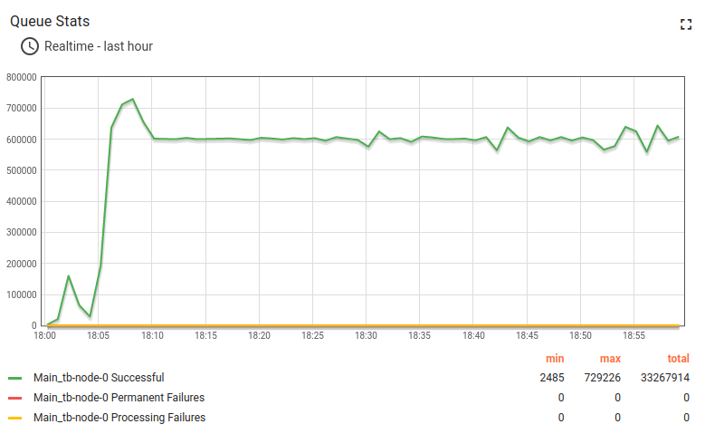

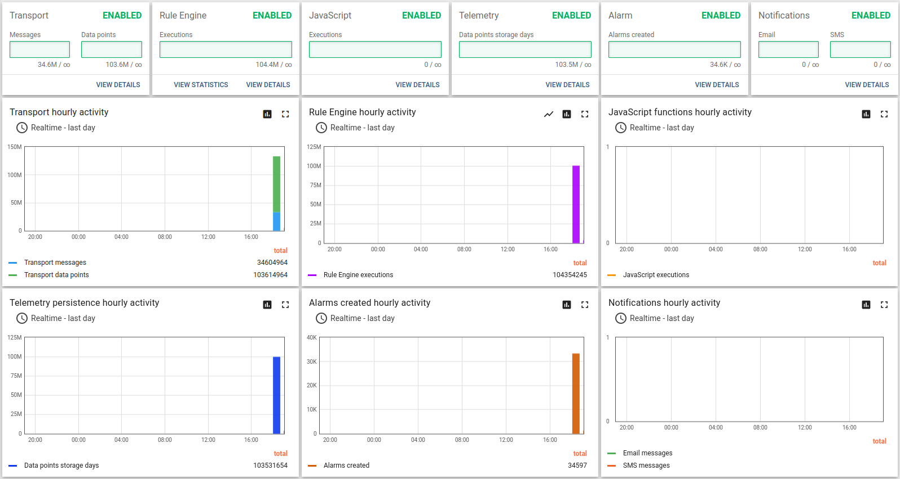

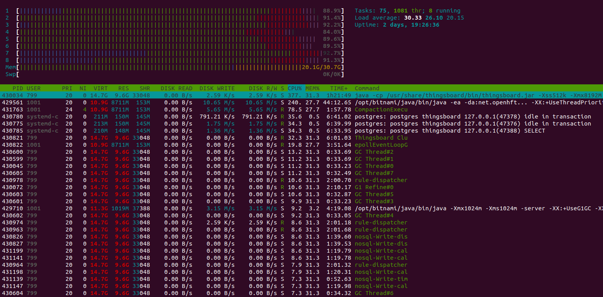

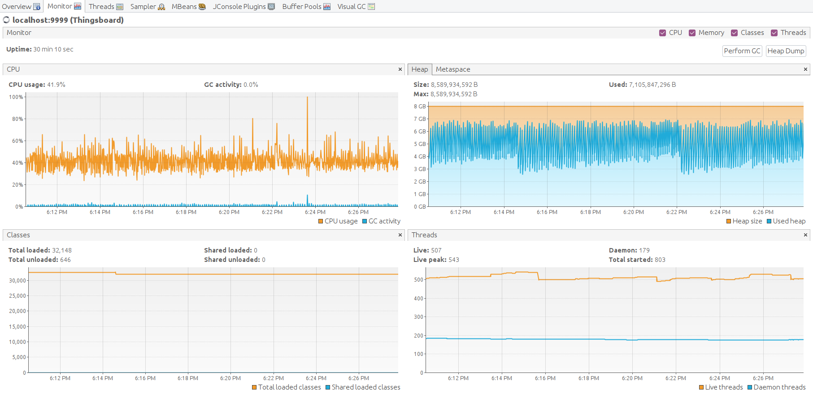

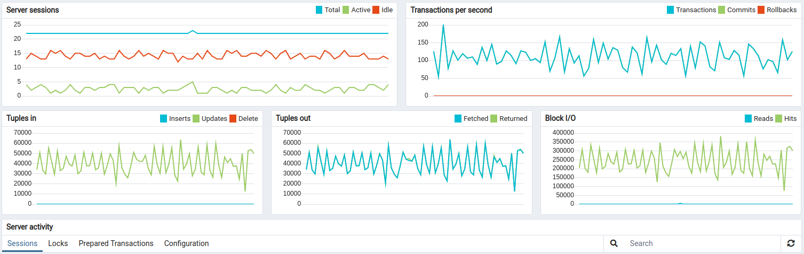

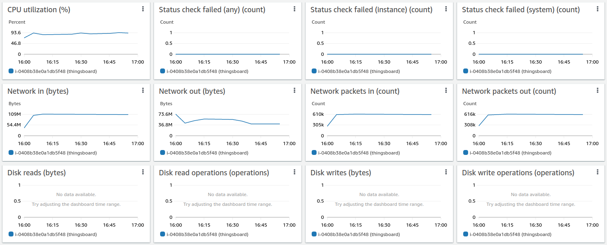

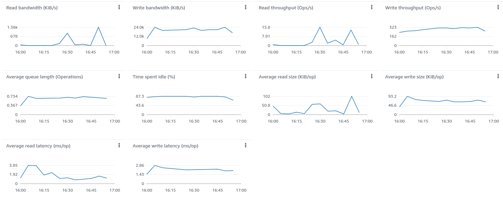

**Conclusion**: the m6a.2xlarge is can handle up to 100k devices with message rate up to 10k/sec.
CPU usage is 93%, so there is almost no spare resources left for a peak load and user activities.

#### Do we really have 100k device connected?

Here some point how to ensure that you have a valid test run with all device created and connected

1. All devices were created. Open device List and check total device count.

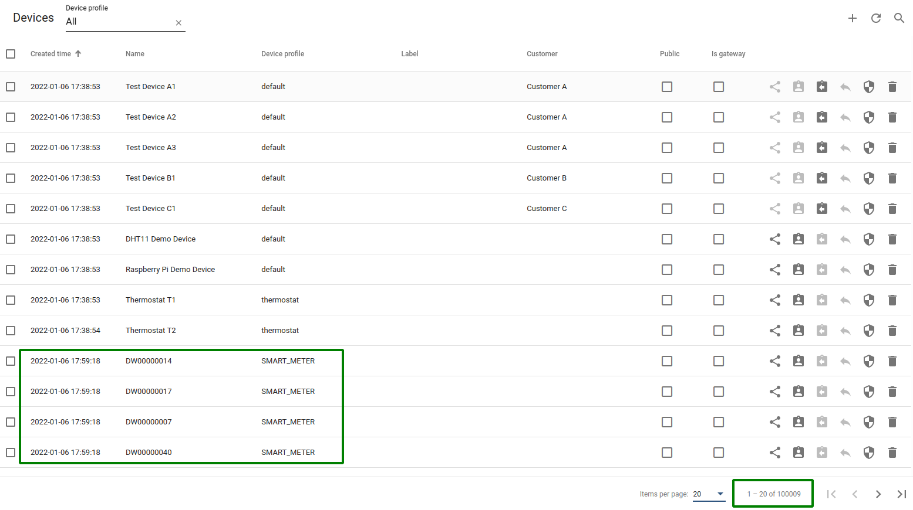

2. All device connected. Check the logs. Device count have to be greater than 100k

```
tb_1         | 2022-01-06 16:37:11,716 [TB-Scheduling-3] INFO  o.t.s.c.t.s.DefaultTransportService - Transport Stats: openConnections [100000]
```

3. All device connected. Java JMX. VisualVM -> Thingsboard -> MBeans -> java.lang -> OpenFileDescriptorCount -> more than 100000

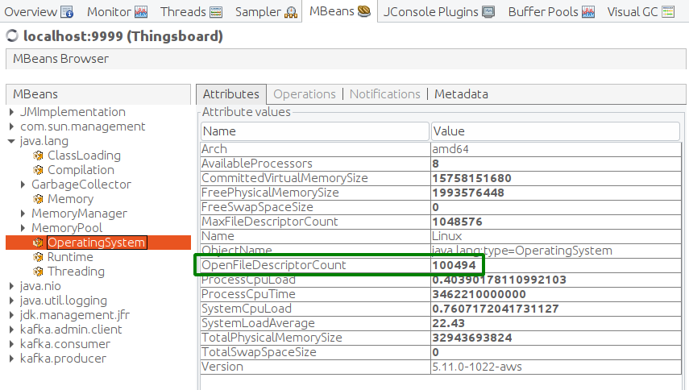

#### 24h test run

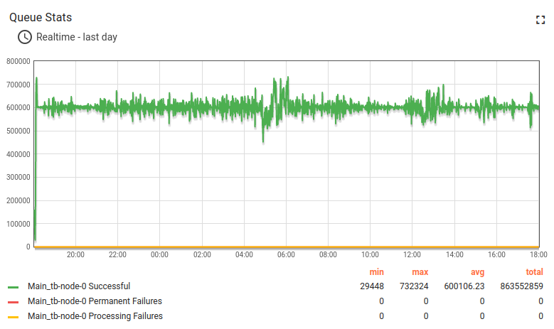

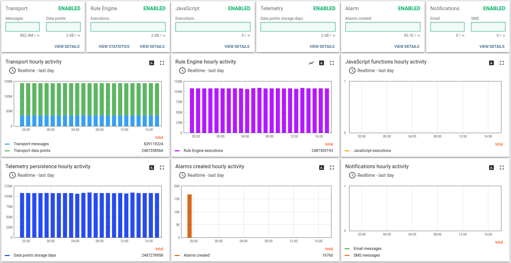

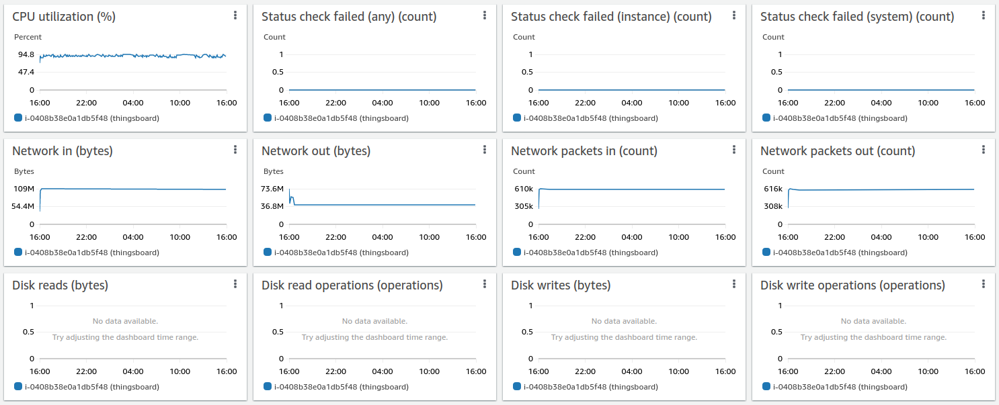

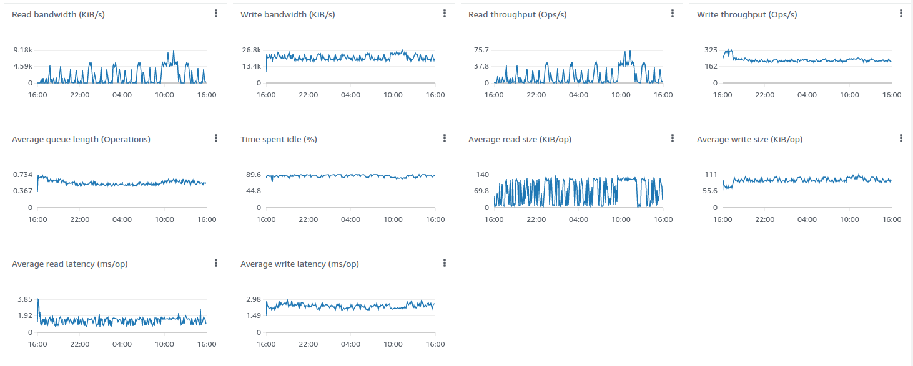

### m6a.2xlarge (8 vCPUs AMD EPYC 3rd, 32 GiB, EBS GP3) + Cassandra - 500k devices, 5k msg/sec, 15k tps

Architecture is 1 Thingsboard server + 20 client instances each supply 25k devices (500k in total). 

500k devices connected


### m6a.4xlarge (16 vCPUs AMD EPYC 3rd, 64 GiB, EBS GP3) + Cassandra - 1Million devices, 5k msg/sec, 15k tps

Architecture is 1 Thingsboard server + 32 clients instances each supply 31250 devices (1 million in total).

Prepare the instance `pt01` example. See the particular scripts that manages many instances at once

```bash
ssh tb2 <<'ENDSSH'
set +x
#optional. replace with your Thingsboard instance ip
#echo '52.50.5.45 thingsboard' | sudo tee -a /etc/hosts
#extend the local port range up to 64500 
cat /proc/sys/net/ipv4/ip_local_port_range
#32768	60999
echo "net.ipv4.ip_local_port_range = 1024 65535" | sudo tee -a /etc/sysctl.conf
sudo -s sysctl -p
cat /proc/sys/net/ipv4/ip_local_port_range
#1024	65535
sudo apt update
sudo apt install -y git maven docker docker-compose htop iotop mc screen
# manage Docker as a non-root user
sudo groupadd docker
sudo usermod -aG docker $USER
newgrp docker
# test non-root docker run
docker run hello-world
cd ~
git clone https://github.com/thingsboard/performance-tests.git
# git pull
cd performance-tests
./build.sh
ENDSSH
```

```bash
ssh pt01 <<'ENDSSH'
cd ~/performance-tests
export REST_URL=http://172.31.25.132:8080
export MQTT_HOST=54.171.220.200
export DEVICE_START_IDX=0
export DEVICE_END_IDX=50000
export MESSAGES_PER_SECOND=500
export ALARMS_PER_SECOND=1
export DURATION_IN_SECONDS=86400
export DEVICE_CREATE_ON_START=true
nohup mvn spring-boot:run &
ENDSSH
```

How to modify the docker file to handle more connections out of the box (optional)

```dockerfile
FROM thingsboard/tb:latest
USER root
RUN echo 'net.ipv4.ip_local_port_range = 12000 65535' >> /etc/sysctl.conf
RUN echo 'fs.file-max = 1048576' >> /etc/sysctl.conf
#RUN mkdir /etc/security/
RUN echo '*                soft    nofile          1048576' >> /etc/security/limits.conf
RUN echo '*                hard    nofile          1048576' >> /etc/security/limits.conf
RUN echo 'root             soft    nofile          1048576' >> /etc/security/limits.conf
RUN echo 'root             hard    nofile          1048576' >> /etc/security/limits.conf
#CMD echo '+1M Connections' # your application here
USER thingsboard
```
{: .copy-code}

Add lines to your limits.conf file.

cat | sudo tee -a /etc/security/limits.conf

```
## /etc/security/limits.conf
## System Limits for FDs
## "nofile" is "Number of Open Files"
## This is the cap on number of FDs in use concurrently.
## Set nofile to the max value of 1,048,576.

#<user>     <type>    <item>     <value>
*           soft      nofile     1048576
*           hard      nofile     1048576
root        soft      nofile     1048576
root        hard      nofile     1048576
```


Add lines to your sysctl.conf file.

cat | sudo tee -a /etc/sysctl.conf

```
## /etc/sysctl.conf
## Increase Outbound Connections
## Good for a service mesh and proxies like
## Nginx/Envoy/HAProxy/Varnish and applications that
## need long-lived connections.
## Careful not to set the range wider as you will impact
## running application ports in heavy usage situations.
net.ipv4.ip_local_port_range = 12000 65535

## Increase Inbound Connections
## Allows for +1M more FDs
## An FD is an integer value used as a traffic I/O pointer
## on a connection with a Client.
## The FD Int value is used to traffic packets between
## User and Kernel Space.
fs.file-max = 1048576
```

Important: to handle more than 256k (limit depends on total memory size) TCP connections, please adjust the `conntrack_max` system parameter.
[reference](http://renbuar.blogspot.com/2019/02/netnetfilternfconntrackmax1048576.html)

Run this once on `thingsboard` node to increase file descriptor and net filter limits. This is required to handle about 1M TCP connections.

```bash
ulimit -n 1048576
sudo sysctl -a | grep conntrack_max
sudo sysctl -w net.netfilter.nf_conntrack_max=1048576
```

scripts for managing 20-32 test instances

_includes/docs/reference/performance-scripts/*.sh

```bash
#1M (million) devices
version: '3'
services:
  cassandra:
    image: bitnami/cassandra:4.0
    network_mode: "host"
    restart: "always"
    volumes:
      - cassandra:/bitnami
    environment:
      CASSANDRA_CLUSTER_NAME: "Thingsboard Cluster"
      HEAP_NEWSIZE: "6144M"
      MAX_HEAP_SIZE: "12288M"
      JVM_EXTRA_OPTS: "-Dcom.sun.management.jmxremote -Dcom.sun.management.jmxremote.port=7199 -Dcom.sun.management.jmxremote.rmi.port=7199  -Dcom.sun.management.jmxremote.authenticate=false -Dcom.sun.management.jmxremote.ssl=false -Djava.rmi.server.hostname=127.0.0.1"
  zookeeper:
    image: docker.io/bitnami/zookeeper:3.7
    network_mode: "host"
    restart: "always"
    volumes:
      - zookeeper:/bitnami
    environment:
      ALLOW_ANONYMOUS_LOGIN: "yes"
      ZOO_ENABLE_ADMIN_SERVER: "no"
      JVMFLAGS: "-Xmx128m -Xms128m -Dcom.sun.management.jmxremote -Dcom.sun.management.jmxremote.port=9199 -Dcom.sun.management.jmxremote.rmi.port=9199  -Dcom.sun.management.jmxremote.authenticate=false -Dcom.sun.management.jmxremote.ssl=false -Djava.rmi.server.hostname=127.0.0.1"
  kafka:
    image: docker.io/bitnami/kafka:3
    network_mode: "host"
    restart: "always"
    volumes:
      - kafka:/bitnami
    environment:
#      KAFKA_CFG_LISTENERS: "PLAINTEXT://:9092"
#      KAFKA_CFG_ADVERTISED_LISTENERS: "PLAINTEXT://127.0.0.1:9092"
      KAFKA_CFG_ZOOKEEPER_CONNECT: "localhost:2181"
      ALLOW_PLAINTEXT_LISTENER: "yes"
      KAFKA_JMX_OPTS: "-Dcom.sun.management.jmxremote -Dcom.sun.management.jmxremote.port=1099 -Dcom.sun.management.jmxremote.rmi.port=1099 -Dcom.sun.management.jmxremote.authenticate=false -Dcom.sun.management.jmxremote.ssl=false -Djava.rmi.server.hostname=127.0.0.1"
      JMX_PORT: "1099"
    depends_on:
      - zookeeper
  postgres:
    image: "postgres:14"
    network_mode: "host"
    restart: "always"
    volumes:
      - postgres:/var/lib/postgresql/data
    environment:
      POSTGRES_DB: "thingsboard"
      POSTGRES_PASSWORD: "postgres"
  tb:
    image: "thingsboard/tb"
#    build:
#      context: .
#      dockerfile: Dockerfile
    depends_on:
      - postgres
      - kafka
      - cassandra
    network_mode: "host"
    restart: "always"
    volumes:
      - thingsboard-data:/data
      - thingsboard-logs:/var/log/thingsboard
    environment:
      DATABASE_TS_TYPE: "cassandra"
      DATABASE_TS_LATEST_TYPE: "cassandra" # this is a key difference
      #Cassandra
      CASSANDRA_CLUSTER_NAME: "Thingsboard Cluster"
      CASSANDRA_LOCAL_DATACENTER: "datacenter1"
      CASSANDRA_KEYSPACE_NAME: "thingsboard"
      CASSANDRA_URL: "127.0.0.1:9042"
      CASSANDRA_USE_CREDENTIALS: "true"
      CASSANDRA_USERNAME: "cassandra"
      CASSANDRA_PASSWORD: "cassandra"
      CASSANDRA_QUERY_BUFFER_SIZE: "3000000"
      CASSANDRA_QUERY_CONCURRENT_LIMIT: "3000"
      CASSANDRA_QUERY_POLL_MS: "3"
      #Kafka
      TB_QUEUE_TYPE: "kafka"
      TB_KAFKA_BATCH_SIZE: "65536" # default is 16384 - it helps to produce messages much efficiently
      TB_KAFKA_LINGER_MS: "5" # default is 1
      TB_QUEUE_KAFKA_MAX_POLL_RECORDS: "2048" # default is 8192
      TB_SERVICE_ID: "tb-node-0"
      HTTP_BIND_PORT: "8088"
      # Queue
      TB_QUEUE_RE_MAIN_PACK_PROCESSING_TIMEOUT_MS: "30000"
      TB_QUEUE_CORE_PACK_PROCESSING_TIMEOUT_MS: "20000"
      TB_QUEUE_RE_MAIN_CONSUMER_PER_PARTITION: "true"
      TB_QUEUE_RE_HP_CONSUMER_PER_PARTITION: "false"
      TB_QUEUE_RE_SQ_CONSUMER_PER_PARTITION: "false"
      ACTORS_SYSTEM_RULE_DISPATCHER_POOL_SIZE: "8"
      # Postgres connection
      SPRING_JPA_DATABASE_PLATFORM: "org.hibernate.dialect.PostgreSQLDialect"
      SPRING_DRIVER_CLASS_NAME: "org.postgresql.Driver"
      SPRING_DATASOURCE_URL: "jdbc:postgresql://localhost:5432/thingsboard"
      SPRING_DATASOURCE_USERNAME: "postgres"
      SPRING_DATASOURCE_PASSWORD: "postgres"
      SPRING_DATASOURCE_MAXIMUM_POOL_SIZE: "25"
      # Cache specs
      #1M devices
      CACHE_SPECS_DEVICES_MAX_SIZE: "1048000" # default is 10000
      CACHE_SPECS_DEVICE_CREDENTIALS_MAX_SIZE: "1048000" # default is 10000 
      CACHE_SPECS_SESSIONS_MAX_SIZE: "1048000" # default is 10000
      TS_KV_PARTITIONS_MAX_CACHE_SIZE: "4194000" # default is 100000
      # Device state service
      DEFAULT_INACTIVITY_TIMEOUT: "1800" # defailt is 600 sec (10min)
      DEFAULT_STATE_CHECK_INTERVAL: "900" # default is 60 sec(1min)
      TB_TRANSPORT_SESSIONS_REPORT_TIMEOUT: "60000" # default is 3000 msec
      TB_TRANSPORT_SESSIONS_INACTIVITY_TIMEOUT: "600000" # default is 300000 msec
      PERSIST_STATE_TO_TELEMETRY: "true" # Persist device state to the Cassandra. Default is false (Postgres, as device server_scope attributes)
      #Transport API
      TB_QUEUE_TRANSPORT_MAX_PENDING_REQUESTS: "1000000" # default is 10k
      #DEBUG
      CASSANDRA_USE_JMX: "true"
      CASSANDRA_USE_METRICS: "true"
      # Java options for 64G instance and JMX enabled 
      JAVA_OPTS: " -Xss512k -Xmx20480M -Xms20480M -XX:+AlwaysPreTouch -Dcom.sun.management.jmxremote -Dcom.sun.management.jmxremote.port=9999 -Dcom.sun.management.jmxremote.rmi.port=9999 -Dcom.sun.management.jmxremote.authenticate=false -Dcom.sun.management.jmxremote.ssl=false -Djava.rmi.server.hostname=127.0.0.1"
    ulimits:
      nofile:
        soft: 1048576
        hard: 1048576
volumes: # to persist data between container restarts or being recreated
  cassandra:
  kafka:
  zookeeper:
  postgres:
  thingsboard-data:
  thingsboard-logs:
```
{: .copy-code}


How to forward JMX port with ssh.
```bash
ssh -L 9999:127.0.0.1:9999 -L 1099:127.0.0.1:1099 -L 9199:127.0.0.1:9199 -L 7199:127.0.0.1:7199 thingsboard 
```

Enable pg_stat_statements preload library for PostgreSQL 
```bash
#config before 
docker exec -it ubuntu_postgres_1 tail /var/lib/postgresql/data/postgresql.conf
#apply changes
docker exec -it ubuntu_postgres_1 /bin/bash
echo "shared_preload_libraries = 'pg_stat_statements'" >> /var/lib/postgresql/data/postgresql.conf
exit
#check the result 
docker exec -it ubuntu_postgres_1 tail /var/lib/postgresql/data/postgresql.conf
```

Check network connection count. 
`watch -n 1 ss -s`

How to make a Java heap dump
```bash
ssh thingsboard
#docker exec -it ubuntu_tb_1 /bin/bash
docker exec -it ubuntu_tb_1 ps -A | grep java
# 8 ?        00:01:46 java
docker exec -it ubuntu_tb_1 jmap -dump:live,format=b,file=/data/dump.hprof 8
# Heap dump file created
sudo mv /var/lib/docker/volumes/ubuntu_thingsboard-data/_data/dump.hprof ~
sudo chown ubuntu:ubuntu ~/dump.hprof
exit
#copy with compression - much faster
scp -C tb2:/home/ubuntu/dump.hprof ~
```

### Experiments

#### Cassandra versions compare

Cassandra 4.0 m6a.xlarge (4 vCPU, 16 GiB)


Cassandra 3.11 m6a.large


Cassandra 4.0 c6i.xlarge (4 vCPU, 8 GiB)


#### Max msg rate experiments

Cassandra 4.0 m6a.4xlarge (16 vCPU, 32 GiB)

5k devices, 15k msg/sec, 45k data points/sec -- 100% handled


5k devices, 25k msg/sec, 75k data points/sec -- 100% handled


5k devices, 40k msg/sec, 120k data points/sec - bottleneck


CPU is about 60%, so bottleneck happens.


Let's try to write timeseries without persisting latest values to the PostgreSQL - no effect


#### m6a.4xlarge (16 vCPUs AMD EPYC 3rd, 64 GiB, EBS GP3)- 500k devices, 10k msg, 30k tps - almost handle

Almost handle

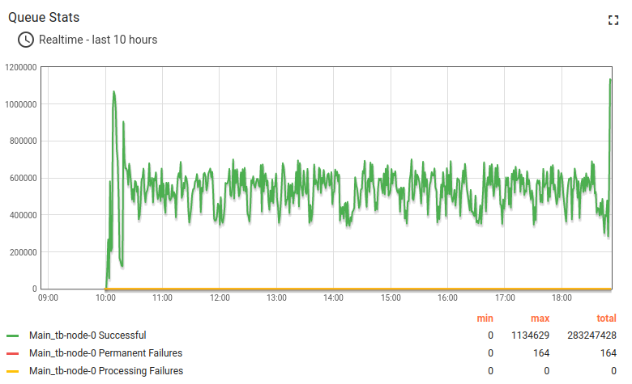

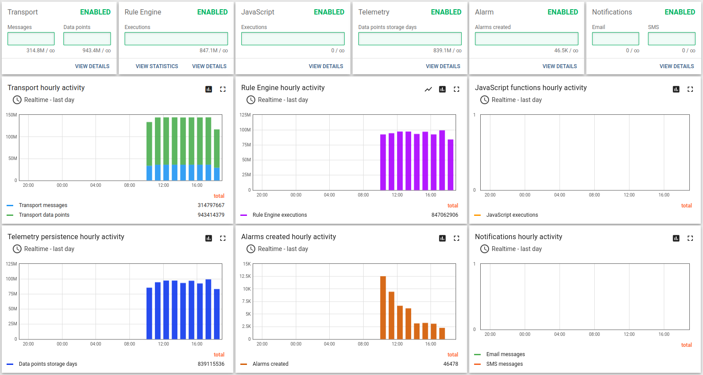

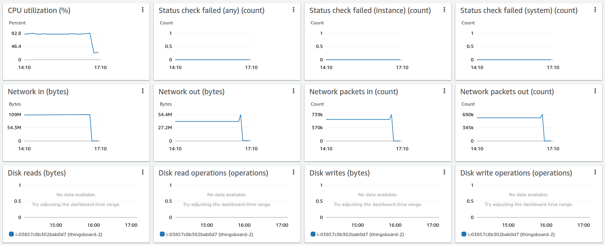

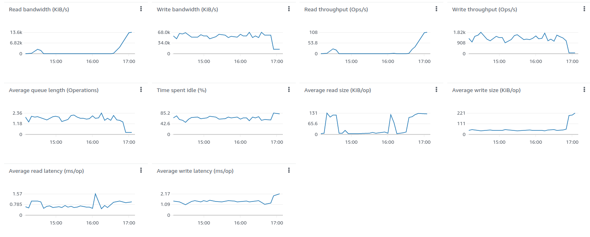


#### m6a.large (2 vCPUs AMD EPYC 3rd, 8 GiB, EBS GP3) + Cassandra - 5k devices , 5k msg/sec, 15k tps ???

5000 devices, 5000 msg/sec, 15000 telemetry/sec, MQTT, Postgres, Kafka, Cassandra

Estimated cost 19$ EC2 + x$ CPU burst + 8$ EBS GP3 100GB = 30$/mo

CPU ??%. This is good setup up to ???? msg/sec, with peak performance up to ???? msg sec

System can survive peak message rate up to message rate ????? msg/sec (?????? telemetry/sec).

```bash
version: '3'
services:
  cassandra:
    image: bitnami/cassandra:4.0
    network_mode: "host"
    restart: "always"
    volumes:
      - cassandra:/bitnami
    environment:
      CASSANDRA_CLUSTER_NAME: "Thingsboard Cluster"
      HEAP_NEWSIZE: "768M"
      MAX_HEAP_SIZE: "1536M"
      JVM_EXTRA_OPTS: "-Dcom.sun.management.jmxremote -Dcom.sun.management.jmxremote.port=7199 -Dcom.sun.management.jmxremote.rmi.port=7199  -Dcom.sun.management.jmxremote.authenticate=false -Dcom.sun.management.jmxremote.ssl=false -Djava.rmi.server.hostname=127.0.0.1"
  zookeeper:
    image: docker.io/bitnami/zookeeper:3.7
    network_mode: "host"
    restart: "always"
    volumes:
      - zookeeper:/bitnami
    environment:
      ALLOW_ANONYMOUS_LOGIN: "yes"
      ZOO_ENABLE_ADMIN_SERVER: "no"
      JVMFLAGS: "-Xmx128m -Xms128m -Dcom.sun.management.jmxremote -Dcom.sun.management.jmxremote.port=9199 -Dcom.sun.management.jmxremote.rmi.port=9199  -Dcom.sun.management.jmxremote.authenticate=false -Dcom.sun.management.jmxremote.ssl=false -Djava.rmi.server.hostname=127.0.0.1"
  kafka:
    image: docker.io/bitnami/kafka:3
    network_mode: "host"
    restart: "always"
    volumes:
      - kafka:/bitnami
    environment:
      KAFKA_CFG_ZOOKEEPER_CONNECT: "localhost:2181"
      ALLOW_PLAINTEXT_LISTENER: "yes"
      KAFKA_JMX_OPTS: "-Dcom.sun.management.jmxremote -Dcom.sun.management.jmxremote.port=1099 -Dcom.sun.management.jmxremote.rmi.port=1099 -Dcom.sun.management.jmxremote.authenticate=false -Dcom.sun.management.jmxremote.ssl=false -Djava.rmi.server.hostname=127.0.0.1"
      JMX_PORT: "1099"
    depends_on:
      - zookeeper
  postgres:
    image: "postgres:14"
    network_mode: "host"
    restart: "always"
    volumes:
      - postgres:/var/lib/postgresql/data
    environment:
      POSTGRES_DB: "thingsboard"
      POSTGRES_PASSWORD: "postgres"
  tb:
    depends_on:
      - postgres
      - kafka
      - cassandra
    image: "thingsboard/tb"
    network_mode: "host"
    restart: "always"
    volumes:
      - thingsboard-data:/data
      - thingsboard-logs:/var/log/thingsboard
    environment:
      DATABASE_TS_TYPE: "cassandra"
      DATABASE_TS_LATEST_TYPE: "sql"
      #Cassandra
      CASSANDRA_CLUSTER_NAME: "Thingsboard Cluster"
      CASSANDRA_LOCAL_DATACENTER: "datacenter1"
      CASSANDRA_KEYSPACE_NAME: "thingsboard"
      CASSANDRA_URL: "127.0.0.1:9042"
      CASSANDRA_USE_CREDENTIALS: "true"
      CASSANDRA_USERNAME: "cassandra"
      CASSANDRA_PASSWORD: "cassandra"
      CASSANDRA_QUERY_BUFFER_SIZE: "100000"
      CASSANDRA_QUERY_CONCURRENT_LIMIT: "1000"
      CASSANDRA_QUERY_POLL_MS: "10"
      #Kafka
      TB_QUEUE_TYPE: "kafka"
      TB_KAFKA_BATCH_SIZE: "65536" # default is 16384 - it helps to produce messages much efficiently
      TB_KAFKA_LINGER_MS: "5" # default is 1
      TB_QUEUE_KAFKA_MAX_POLL_RECORDS: "2048" # default is 8192
      TB_SERVICE_ID: "tb-node-0"
      HTTP_BIND_PORT: "8080"
      TB_QUEUE_RE_MAIN_PACK_PROCESSING_TIMEOUT_MS: "30000"
      # Postgres connection
      SPRING_JPA_DATABASE_PLATFORM: "org.hibernate.dialect.PostgreSQLDialect"
      SPRING_DRIVER_CLASS_NAME: "org.postgresql.Driver"
      SPRING_DATASOURCE_URL: "jdbc:postgresql://localhost:5432/thingsboard"
      SPRING_DATASOURCE_USERNAME: "postgres"
      SPRING_DATASOURCE_PASSWORD: "postgres"
      # Java options for 8G instance and JMX enabled
      JAVA_OPTS: " -Xmx2560M -Xms2560M -Dcom.sun.management.jmxremote -Dcom.sun.management.jmxremote.port=9999 -Dcom.sun.management.jmxremote.rmi.port=9999 -Dcom.sun.management.jmxremote.authenticate=false -Dcom.sun.management.jmxremote.ssl=false -Djava.rmi.server.hostname=127.0.0.1"
volumes: # to persist data between container restarts or being recreated
  cassandra:
  kafka:
  zookeeper:
  postgres:
  thingsboard-data:
  thingsboard-logs:
```

Performance test docker run
```bash
docker run -it --rm --network host --name tb-perf-test \
  --env REST_URL=http://thingsboard:8080 \
  --env MQTT_HOST=thingsboard \
  --env DEVICE_END_IDX=5000 \
  --env MESSAGES_PER_SECOND=5000 \
  --env ALARMS_PER_SECOND=50 \
  --env DURATION_IN_SECONDS=86400 \
  thingsboard/tb-ce-performance-test:latest
```
{: .copy-code}

[comment]: <> (TODO)
